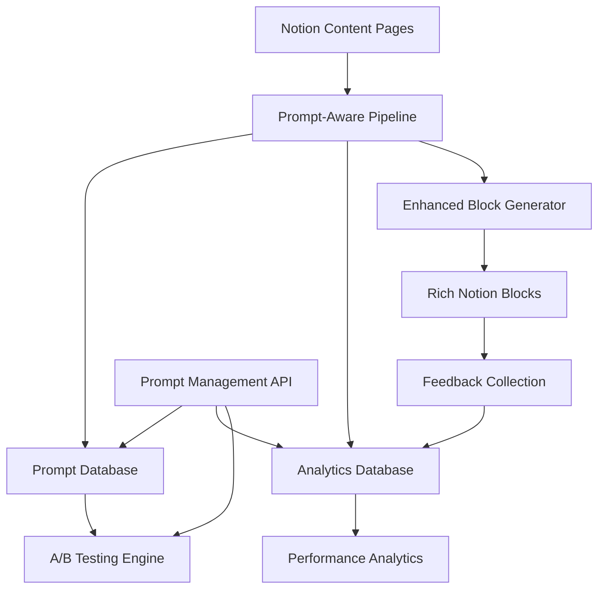

# Prompt-Aware Content Assembly System Architecture

## 🚀 Overview

This document describes the complete system architecture for the new prompt-aware content assembly system that provides full traceability between prompts and generated content, enabling continuous improvement through feedback loops and A/B testing.

## 🎯 Design Goals

1. **Full Traceability**: Every piece of content links back to its generating prompt
2. **Performance Analytics**: Track prompt effectiveness with detailed metrics
3. **Continuous Improvement**: Enable prompt optimization through feedback loops
4. **A/B Testing**: Support prompt variants and performance comparison
5. **Cross-Prompt Intelligence**: Detect relationships between outputs from different prompts
6. **User Feedback**: Collect ratings and usage data for prompt improvement

## 🏗️ System Architecture

### Core Components



### Data Flow

1. **Content Ingestion**: Raw content enters the system
2. **Prompt Selection**: System selects appropriate prompts based on content type
3. **Parallel Analysis**: Multiple analyzers run simultaneously with tracked prompts
4. **Cross-Intelligence**: System analyzes relationships between outputs
5. **Block Generation**: Rich Notion blocks created with prompt attribution
6. **Feedback Collection**: Users rate content quality and usefulness
7. **Analytics Update**: Performance metrics updated in real-time

## 📊 Data Models

### TrackedAnalyzerResult

```python
@dataclass
class TrackedAnalyzerResult:
    # Core content
    content: str
    content_type: str
    analyzer_type: str
    
    # Prompt tracking
    prompt_id: str
    prompt_name: str
    prompt_version: str
    prompt_page_url: str
    
    # Quality metrics
    quality_score: float
    confidence_score: float
    coherence_score: float
    actionability_score: float
    
    # Generation metadata
    generation_timestamp: datetime
    temperature_used: float
    model_used: str
    token_count: int
    generation_time_ms: int
    
    # Enhanced features
    web_search_enabled: bool
    citations: List[Citation]
    cross_references: List[str]
    
    # Structured content
    key_points: List[str]
    action_items: List[str]
    entities_mentioned: List[str]
    topics_covered: List[str]
```

### PromptPerformanceMetrics

```python
@dataclass
class PromptPerformanceMetrics:
    prompt_id: str
    total_uses: int = 0
    total_quality_score: float = 0.0
    total_user_ratings: float = 0.0
    rating_count: int = 0
    
    # Detailed metrics
    coherence_scores: List[float]
    actionability_scores: List[float]
    generation_times: List[int]
    token_usage: List[int]
    
    # A/B testing
    ab_test_group: Optional[str] = None
    conversion_rate: float = 0.0
```

## 🗄️ Database Schema

### Notion Prompts Database

| Property | Type | Description |
|----------|------|-------------|
| Name | Title | Human-readable prompt name |
| Analyzer Type | Select | summarizer, insights, classifier, etc. |
| Content Type | Select | technical_paper, market_analysis, etc. |
| System Prompt | Rich Text | System-level instructions |
| User Prompt Template | Rich Text | Template with variables |
| Version | Number | Prompt version (e.g., 2.1) |
| Active | Checkbox | Whether prompt is in use |
| Temperature | Number | Model temperature setting |
| Web Search | Checkbox | Enable web search |
| Quality Threshold | Percent | Minimum quality required |
| Usage Count | Number | Times prompt has been used |
| Average Quality Score | Percent | Average quality across uses |
| Average User Rating | Number | User feedback average |
| A/B Test Group | Select | Control, Variant A, B, C |

### Notion Analytics Database

| Property | Type | Description |
|----------|------|-------------|
| Analysis ID | Title | Unique identifier |
| Prompt | Relation | Link to prompt used |
| Content Page | Relation | Link to content analyzed |
| Timestamp | Date | When analysis ran |
| Quality Score | Percent | Calculated quality |
| User Rating | Select | ⭐⭐⭐⭐⭐ |
| Useful | Checkbox | User found it useful |
| Acted On | Checkbox | User took action |
| Generation Time | Number | Time in milliseconds |
| Token Count | Number | Tokens consumed |
| Model Used | Select | gpt-4, claude-3, etc. |
| Web Search Used | Checkbox | Whether web search was used |
| Citation Count | Number | Number of sources |

## 🔄 API Endpoints

### Prompt Management

```
GET    /prompts                    # List prompts with filtering
GET    /prompts/{id}               # Get specific prompt
POST   /prompts                    # Create new prompt
PATCH  /prompts/{id}               # Update prompt
POST   /prompts/{id}/duplicate     # Copy prompt
```

### Analytics

```
GET    /analytics/summary          # Overall analytics
GET    /analytics/prompt/{id}      # Prompt-specific metrics
POST   /analytics/query            # Query with filters
```

### Feedback

```
POST   /feedback                   # Submit user feedback
```

### A/B Testing

```
POST   /ab_tests                   # Create A/B test
GET    /ab_tests/{id}/results      # Get test results
```

## 🧠 Cross-Prompt Intelligence

### Entity Index
- Tracks entities mentioned across all analyzer outputs
- Enables cross-referencing related content
- Builds knowledge graph over time

### Topic Clustering
- Groups related topics from different analyzers
- Identifies common themes and patterns
- Suggests complementary insights

### Action Item Consolidation
- Deduplicates similar action items from multiple sources
- Prioritizes based on confidence and source count
- Creates unified action plans

### Citation Analysis
- Tracks source overlap between different analyses
- Identifies most valuable sources
- Prevents redundant research

## 📈 Quality Metrics

### Automated Quality Scores

1. **Coherence Score**: Measures logical flow and consistency
2. **Actionability Score**: Presence of specific, actionable insights
3. **Evidence Score**: Citation quality and relevance
4. **Novelty Score**: Unique insights not present in source

### User Feedback Integration

1. **Star Ratings**: 1-5 stars per analysis section
2. **Usefulness Flags**: Binary useful/not useful
3. **Action Tracking**: Did user act on insights?
4. **Free-form Feedback**: Suggestions for improvement

## 🔬 A/B Testing Framework

### Test Configuration
- **Control Group**: Current best-performing prompt
- **Variant Groups**: Alternative prompt versions
- **Traffic Split**: Configurable percentage allocation
- **Success Metrics**: Quality score, user rating, action rate

### Statistical Analysis
- Confidence intervals for performance differences
- Sample size calculations
- Statistical significance testing
- Automatic winner selection

## 🎨 Enhanced Notion Blocks

### Prompt Attribution Block
```
🎯 Prompt Attribution
━━━━━━━━━━━━━━━━━━━━
Prompt: [Advanced Summarizer v2.1](notion://...)
Quality: ⭐⭐⭐⭐ (84%)
Performance: 🚀 1.2s | 2,847 tokens
Web Search: ✅ Enabled (5 sources)
```

### Quality Dashboard
```
📊 Analysis Performance Summary
━━━━━━━━━━━━━━━━━━━━━━━━━━━━━━
• Total Generation Time: 4.7s
• Total Tokens Used: 8,234
• Average Quality Score: 87%
• Estimated Cost: $0.019

Prompt Performance:
• Summarizer: 84% quality, 1.2s, efficiency: 70.0
• Insights: 91% quality, 2.1s, efficiency: 43.3
• Classifier: 78% quality, 0.9s, efficiency: 86.7
```

### Cross-Analysis Insights
```
🔗 Cross-Analysis Insights
━━━━━━━━━━━━━━━━━━━━━━━━━
📋 Consolidated Action Plan
🔴 Implement API rate limiting (from Technical, Security)
🟡 Update documentation (from Technical, Strategy)
🟢 Monitor performance metrics (from Technical)

🔮 Common Themes Identified:
• Performance Optimization: mentioned in 3 analyses
• Security Concerns: highlighted by 2 analyzers
• User Experience: cross-referenced 4 times
```

### Interactive Feedback Section
```
📊 Rate This Analysis
━━━━━━━━━━━━━━━━━━━━
┌─────────────┬─────────┬────────────┬─────────────┐
│ Analyzer    │ Quality │ Usefulness │ Actions     │
├─────────────┼─────────┼────────────┼─────────────┤
│ Summary     │ ⭐⭐⭐⭐⭐ │ ☑ Very useful│ [Rate Prompt]│
│ Insights    │ ⭐⭐⭐⭐  │ ☐ Somewhat  │ [Rate Prompt]│
│ Technical   │ ⭐⭐⭐⭐⭐ │ ☑ Very useful│ [Rate Prompt]│
└─────────────┴─────────┴────────────┴─────────────┘
```

## 🔒 Security & Privacy

### Data Protection
- No sensitive content stored in prompt templates
- User feedback anonymized after aggregation
- Secure API authentication with rate limiting
- Audit logs for all prompt modifications

### Access Controls
- Role-based access to prompt management
- Separate permissions for viewing vs. editing
- A/B test access restricted to authorized users
- Analytics data filtered by user permissions

## 🚀 Implementation Plan

### Phase 1: Core Infrastructure (Week 1-2)
- [ ] Set up Notion databases with schemas
- [ ] Implement `PromptAwareEnrichmentPipeline`
- [ ] Create `TrackedAnalyzerResult` data model
- [ ] Build basic prompt attribution blocks

### Phase 2: Analytics & Feedback (Week 3-4)
- [ ] Implement performance metrics collection
- [ ] Build analytics dashboard in Notion
- [ ] Create feedback collection UI
- [ ] Set up real-time metrics updates

### Phase 3: Cross-Intelligence (Week 5-6)
- [ ] Implement entity and topic indexing
- [ ] Build action item consolidation
- [ ] Create cross-reference detection
- [ ] Add complementary insights analysis

### Phase 4: A/B Testing (Week 7-8)
- [ ] Build A/B testing framework
- [ ] Implement traffic splitting
- [ ] Create statistical analysis tools
- [ ] Add automated winner selection

### Phase 5: API & Management (Week 9-10)
- [ ] Build RESTful API with FastAPI
- [ ] Create prompt management interface
- [ ] Implement bulk operations
- [ ] Add comprehensive error handling

## 📋 Success Metrics

### System Performance
- **Response Time**: < 5 seconds for full analysis
- **Accuracy**: > 85% user satisfaction rating
- **Coverage**: 100% prompt attribution
- **Reliability**: < 1% failure rate

### User Engagement
- **Feedback Rate**: > 60% of analyses rated
- **Action Rate**: > 40% of insights acted upon
- **Return Usage**: Users return within 7 days
- **Quality Improvement**: 10% quarterly improvement

### Business Impact
- **Prompt Efficiency**: 25% improvement in quality/cost ratio
- **Time Savings**: 50% reduction in manual analysis time
- **Decision Quality**: Measurable improvement in outcomes
- **System Adoption**: 90% of content uses new system

## 🔮 Future Enhancements

### Advanced Analytics
- Machine learning-based quality prediction
- Automatic prompt optimization suggestions
- Predictive analytics for content types
- Natural language query interface

### Enhanced Intelligence
- Deep learning embeddings for content similarity
- Automatic topic modeling and clustering
- Sentiment analysis integration
- Multi-language support

### Integration Capabilities
- Slack/Teams integration for notifications
- Calendar integration for action items
- CRM integration for follow-up tracking
- External tool integrations (Zapier, etc.)

---

*This architecture provides a foundation for building a world-class prompt-aware content assembly system that evolves and improves continuously through user feedback and analytics.*