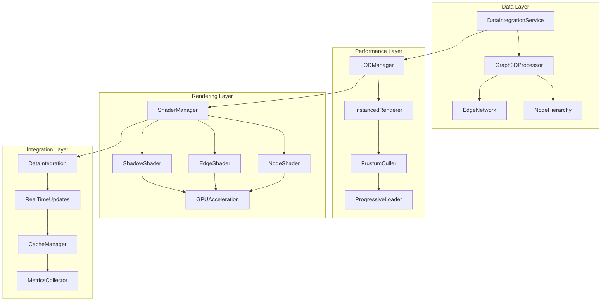

# 3D Knowledge Graph Visualization Architecture Design

## Executive Summary

This document outlines the comprehensive architecture for a high-performance 3D knowledge graph visualization system, designed to handle complex data relationships with real-time updates, GPU acceleration, and advanced performance optimizations.

## Current State Analysis

### Existing Implementation
- **Framework**: Three.js with React Three Fiber (@react-three/fiber v9.3.0)
- **Data Layer**: DataIntegrationService with Notion integration
- **Rendering**: Basic sphere nodes with line edges
- **Layout**: Force-directed algorithm with simple physics
- **Performance**: Basic rendering without optimization

### Architecture Gaps Identified
1. No Level of Detail (LOD) system
2. Missing instanced rendering for performance
3. No frustum culling implementation
4. Lack of progressive loading
5. Basic shaders without GPU optimization
6. No advanced performance monitoring

## Core Architecture Design

### 1. System Overview



### 2. Component Architecture

#### A. Data Processing Pipeline
- **Graph3DProcessor**: Enhanced data transformation with spatial indexing
- **NodeHierarchy**: Multi-level node organization for LOD
- **EdgeNetwork**: Optimized edge representation with clustering
- **SpatialIndex**: Octree-based spatial partitioning

#### B. Rendering Engine
- **InstancedRenderer**: GPU-based instanced rendering for similar objects
- **LODManager**: Dynamic level-of-detail management
- **FrustumCuller**: View-frustum culling for performance
- **ProgressiveLoader**: Asynchronous loading of graph data

#### C. Shader System
- **NodeShader**: Custom vertex/fragment shaders for nodes
- **EdgeShader**: Gradient-based edge rendering
- **ShadowShader**: Optimized shadow mapping
- **PostProcessing**: Screen-space effects and anti-aliasing

## Performance Optimization Strategy

### 1. Level of Detail (LOD) System

#### LOD Level Configuration
```typescript
interface LODConfiguration {
  level0: {  // Close (0-100 units)
    nodeDetail: 'high',
    nodeGeometry: 'icosphere-32',
    edgeDetail: 'full',
    particleEffects: true,
    shadows: true,
    labels: 'all'
  },
  level1: {  // Medium (100-500 units)
    nodeDetail: 'medium',
    nodeGeometry: 'icosphere-16',
    edgeDetail: 'simplified',
    particleEffects: false,
    shadows: false,
    labels: 'important'
  },
  level2: {  // Far (500+ units)
    nodeDetail: 'low',
    nodeGeometry: 'billboard',
    edgeDetail: 'clustered',
    particleEffects: false,
    shadows: false,
    labels: 'none'
  }
}
```

#### LOD Implementation Strategy
```typescript
class LODManager {
  private lodLevels: LODConfiguration;
  private cameraPosition: Vector3;
  private nodeDistances: Map<string, number>;
  
  updateNodeLOD(nodes: Node3D[], camera: Camera): void {
    nodes.forEach(node => {
      const distance = camera.position.distanceTo(node.position);
      const lodLevel = this.calculateLODLevel(distance);
      this.applyLODSettings(node, lodLevel);
    });
  }
  
  private calculateLODLevel(distance: number): number {
    if (distance <= 100) return 0;
    if (distance <= 500) return 1;
    return 2;
  }
}
```

### 2. Instanced Rendering System

#### Instance Management
```typescript
interface InstancedRenderingConfig {
  nodeTypes: {
    document: {
      maxInstances: 10000,
      geometryType: 'sphere',
      shader: 'standard'
    },
    concept: {
      maxInstances: 5000,
      geometryType: 'octahedron',
      shader: 'glowing'
    },
    tag: {
      maxInstances: 15000,
      geometryType: 'cube',
      shader: 'flat'
    }
  }
}

class InstancedRenderer {
  private instancedMeshes: Map<string, InstancedMesh>;
  private instanceMatrices: Map<string, Matrix4[]>;
  
  updateInstances(nodes: Node3D[]): void {
    // Group nodes by type for instanced rendering
    const nodeGroups = this.groupNodesByType(nodes);
    
    nodeGroups.forEach((typeNodes, nodeType) => {
      const instancedMesh = this.instancedMeshes.get(nodeType);
      if (instancedMesh) {
        this.updateInstanceMatrices(instancedMesh, typeNodes);
      }
    });
  }
  
  private updateInstanceMatrices(mesh: InstancedMesh, nodes: Node3D[]): void {
    nodes.forEach((node, index) => {
      const matrix = new Matrix4();
      matrix.compose(node.position, node.rotation, node.scale);
      mesh.setMatrixAt(index, matrix);
    });
    mesh.instanceMatrix.needsUpdate = true;
  }
}
```

### 3. Frustum Culling Implementation

```typescript
class FrustumCuller {
  private frustum: Frustum;
  private cameraMatrix: Matrix4;
  
  constructor(camera: Camera) {
    this.frustum = new Frustum();
    this.cameraMatrix = new Matrix4();
  }
  
  cullNodes(nodes: Node3D[], camera: Camera): Node3D[] {
    // Update frustum from camera
    this.cameraMatrix.multiplyMatrices(
      camera.projectionMatrix, 
      camera.matrixWorldInverse
    );
    this.frustum.setFromProjectionMatrix(this.cameraMatrix);
    
    // Test nodes against frustum
    return nodes.filter(node => {
      const boundingSphere = new Sphere(node.position, node.size);
      return this.frustum.intersectsSphere(boundingSphere);
    });
  }
  
  cullEdges(edges: Edge3D[], visibleNodes: Set<string>): Edge3D[] {
    return edges.filter(edge => 
      visibleNodes.has(edge.source) && visibleNodes.has(edge.target)
    );
  }
}
```

### 4. Progressive Loading System

```typescript
interface LoadingPriority {
  immediate: string[];  // Core nodes
  high: string[];      // Connected to core
  medium: string[];    // Within view
  low: string[];       // Background
}

class ProgressiveLoader {
  private loadingQueue: Map<string, LoadingPriority>;
  private loadedChunks: Set<string>;
  
  async loadGraphData(
    center: Vector3, 
    radius: number
  ): Promise<GraphChunk> {
    const priorities = this.calculateLoadingPriorities(center, radius);
    
    // Load immediate priority first
    const immediateData = await this.loadChunk(priorities.immediate);
    
    // Queue other priorities
    this.queueBackgroundLoading(priorities);
    
    return immediateData;
  }
  
  private async loadChunk(nodeIds: string[]): Promise<GraphChunk> {
    return this.dataService.getGraphChunk({
      nodeIds,
      includeEdges: true,
      maxDepth: 2
    });
  }
}
```

## Shader Design System

### 1. Node Rendering Shaders

#### Vertex Shader (nodes.vert)
```glsl
#version 300 es
precision highp float;

// Attributes
in vec3 position;
in vec3 normal;
in vec2 uv;
in vec3 instancePosition;
in vec3 instanceScale;
in vec4 instanceColor;
in float instanceOpacity;

// Uniforms
uniform mat4 modelViewMatrix;
uniform mat4 projectionMatrix;
uniform mat3 normalMatrix;
uniform vec3 cameraPosition;
uniform float time;

// Varyings
out vec3 vWorldPosition;
out vec3 vNormal;
out vec2 vUv;
out vec4 vColor;
out float vOpacity;
out float vDistance;

void main() {
    // Calculate world position
    vec3 worldPosition = position * instanceScale + instancePosition;
    vWorldPosition = worldPosition;
    
    // Calculate distance for LOD
    vDistance = distance(worldPosition, cameraPosition);
    
    // Transform normal
    vNormal = normalMatrix * normal;
    
    // Pass through texture coordinates
    vUv = uv;
    
    // Pass through instance data
    vColor = instanceColor;
    vOpacity = instanceOpacity;
    
    // Calculate final position
    gl_Position = projectionMatrix * modelViewMatrix * vec4(worldPosition, 1.0);
}
```

#### Fragment Shader (nodes.frag)
```glsl
#version 300 es
precision highp float;

// Varyings
in vec3 vWorldPosition;
in vec3 vNormal;
in vec2 vUv;
in vec4 vColor;
in float vOpacity;
in float vDistance;

// Uniforms
uniform vec3 cameraPosition;
uniform float time;
uniform sampler2D diffuseTexture;
uniform sampler2D normalTexture;
uniform vec3 lightPosition;
uniform vec3 lightColor;
uniform float metalness;
uniform float roughness;

// Output
out vec4 fragColor;

// PBR lighting function
vec3 computePBR(vec3 albedo, vec3 normal, vec3 viewDir, vec3 lightDir) {
    // Simplified PBR implementation
    vec3 halfDir = normalize(lightDir + viewDir);
    float NdotL = max(dot(normal, lightDir), 0.0);
    float NdotV = max(dot(normal, viewDir), 0.0);
    float NdotH = max(dot(normal, halfDir), 0.0);
    
    // Fresnel
    vec3 F0 = mix(vec3(0.04), albedo, metalness);
    vec3 F = F0 + (1.0 - F0) * pow(1.0 - NdotV, 5.0);
    
    // Distribution
    float alpha = roughness * roughness;
    float alpha2 = alpha * alpha;
    float denom = NdotH * NdotH * (alpha2 - 1.0) + 1.0;
    float D = alpha2 / (3.14159265 * denom * denom);
    
    // Geometry
    float k = (roughness + 1.0) * (roughness + 1.0) / 8.0;
    float G1L = NdotL / (NdotL * (1.0 - k) + k);
    float G1V = NdotV / (NdotV * (1.0 - k) + k);
    float G = G1L * G1V;
    
    // BRDF
    vec3 numerator = D * G * F;
    float denominator = 4.0 * NdotV * NdotL + 0.001;
    vec3 specular = numerator / denominator;
    
    vec3 kS = F;
    vec3 kD = vec3(1.0) - kS;
    kD *= 1.0 - metalness;
    
    return (kD * albedo / 3.14159265 + specular) * lightColor * NdotL;
}

void main() {
    // Sample textures
    vec4 diffuse = texture(diffuseTexture, vUv);
    vec3 normal = normalize(vNormal);
    
    // Calculate lighting
    vec3 viewDir = normalize(cameraPosition - vWorldPosition);
    vec3 lightDir = normalize(lightPosition - vWorldPosition);
    
    // Compute PBR lighting
    vec3 color = computePBR(diffuse.rgb * vColor.rgb, normal, viewDir, lightDir);
    
    // Add selection glow effect
    float glowIntensity = smoothstep(0.8, 1.0, vColor.a);
    color += glowIntensity * vColor.rgb * 0.5;
    
    // Distance-based alpha for LOD
    float alpha = vOpacity * smoothstep(1000.0, 100.0, vDistance);
    
    fragColor = vec4(color, alpha);
}
```

### 2. Edge Rendering Shaders

#### Edge Vertex Shader (edges.vert)
```glsl
#version 300 es
precision highp float;

// Attributes
in vec3 position;
in vec3 direction;
in float progress;
in vec4 color;
in float thickness;

// Uniforms
uniform mat4 modelViewMatrix;
uniform mat4 projectionMatrix;
uniform vec3 cameraPosition;
uniform float time;

// Varyings
out vec4 vColor;
out float vProgress;
out float vThickness;

void main() {
    // Calculate world position along edge
    vec3 worldPosition = position + direction * progress;
    
    // Pass through attributes
    vColor = color;
    vProgress = progress;
    vThickness = thickness;
    
    gl_Position = projectionMatrix * modelViewMatrix * vec4(worldPosition, 1.0);
}
```

#### Edge Fragment Shader (edges.frag)
```glsl
#version 300 es
precision highp float;

// Varyings
in vec4 vColor;
in float vProgress;
in float vThickness;

// Uniforms
uniform float time;
uniform float animationSpeed;

// Output
out vec4 fragColor;

void main() {
    // Create gradient effect along edge
    float gradient = smoothstep(0.0, 0.1, vProgress) * 
                    smoothstep(1.0, 0.9, vProgress);
    
    // Add animated flow effect
    float flow = sin(vProgress * 10.0 - time * animationSpeed) * 0.5 + 0.5;
    
    // Calculate final color
    vec3 color = vColor.rgb * gradient;
    color += flow * vColor.rgb * 0.3;
    
    // Distance-based thickness falloff
    float alpha = vColor.a * gradient * vThickness;
    
    fragColor = vec4(color, alpha);
}
```

### 3. Shadow Mapping Shader

#### Shadow Vertex Shader (shadow.vert)
```glsl
#version 300 es
precision highp float;

// Attributes
in vec3 position;
in vec3 instancePosition;
in vec3 instanceScale;

// Uniforms
uniform mat4 lightSpaceMatrix;

void main() {
    vec3 worldPosition = position * instanceScale + instancePosition;
    gl_Position = lightSpaceMatrix * vec4(worldPosition, 1.0);
}
```

## GPU Acceleration Features

### 1. Compute Shader Integration
```typescript
class GPUComputeManager {
  private computeShaders: Map<string, WebGLProgram>;
  private buffers: Map<string, WebGLBuffer>;
  
  initializeComputeShaders(gl: WebGL2RenderingContext): void {
    // Physics simulation shader
    this.loadComputeShader('physics', physicsComputeShader);
    
    // Node clustering shader
    this.loadComputeShader('clustering', clusteringComputeShader);
    
    // LOD calculation shader
    this.loadComputeShader('lod', lodComputeShader);
  }
  
  runPhysicsSimulation(
    nodePositions: Float32Array,
    nodeVelocities: Float32Array,
    edges: Float32Array
  ): Float32Array {
    // Execute physics compute shader
    const program = this.computeShaders.get('physics');
    // Implementation details...
    return updatedPositions;
  }
}
```

### 2. GPU Memory Management
```typescript
class GPUMemoryManager {
  private memoryPools: Map<string, WebGLBuffer[]>;
  private activeBuffers: Set<WebGLBuffer>;
  
  allocateBuffer(type: string, size: number): WebGLBuffer {
    const pool = this.memoryPools.get(type) || [];
    
    // Reuse existing buffer if available
    const availableBuffer = pool.find(buffer => 
      this.getBufferSize(buffer) >= size
    );
    
    if (availableBuffer) {
      this.activeBuffers.add(availableBuffer);
      return availableBuffer;
    }
    
    // Create new buffer
    const newBuffer = this.createBuffer(type, size);
    this.activeBuffers.add(newBuffer);
    return newBuffer;
  }
  
  releaseBuffer(buffer: WebGLBuffer): void {
    this.activeBuffers.delete(buffer);
    // Return to appropriate pool for reuse
  }
}
```

## Data Flow Integration

### 1. Real-Time Update Pipeline
```typescript
class RealTimeDataIntegration {
  private updateQueue: GraphUpdate[];
  private batchProcessor: BatchProcessor;
  
  constructor(
    private dataService: DataIntegrationService,
    private renderer: Graph3DRenderer
  ) {
    this.setupRealTimeListeners();
  }
  
  private setupRealTimeListeners(): void {
    this.dataService.on('nodeAdded', (node) => {
      this.updateQueue.push({
        type: 'add_node',
        data: node,
        priority: 'high'
      });
    });
    
    this.dataService.on('nodeUpdated', (node) => {
      this.updateQueue.push({
        type: 'update_node',
        data: node,
        priority: 'medium'
      });
    });
    
    this.dataService.on('edgeAdded', (edge) => {
      this.updateQueue.push({
        type: 'add_edge',
        data: edge,
        priority: 'medium'
      });
    });
  }
  
  processUpdates(): void {
    const batch = this.batchProcessor.createBatch(this.updateQueue);
    this.renderer.applyUpdates(batch);
    this.updateQueue = [];
  }
}
```

### 2. Cache Management System
```typescript
class Graph3DCacheManager {
  private geometryCache: Map<string, BufferGeometry>;
  private materialCache: Map<string, Material>;
  private textureCache: Map<string, Texture>;
  
  getCachedGeometry(key: string, generator: () => BufferGeometry): BufferGeometry {
    if (!this.geometryCache.has(key)) {
      this.geometryCache.set(key, generator());
    }
    return this.geometryCache.get(key)!;
  }
  
  preloadAssets(nodeTypes: string[]): Promise<void> {
    const promises = nodeTypes.map(type => 
      this.preloadNodeAssets(type)
    );
    return Promise.all(promises).then(() => {});
  }
}
```

## Performance Monitoring & Metrics

### 1. Performance Metrics Collection
```typescript
interface PerformanceMetrics {
  rendering: {
    fps: number;
    frameTime: number;
    drawCalls: number;
    trianglesRendered: number;
    gpuMemoryUsage: number;
  };
  
  culling: {
    totalNodes: number;
    visibleNodes: number;
    culledNodes: number;
    cullingTime: number;
  };
  
  lod: {
    level0Nodes: number;
    level1Nodes: number;
    level2Nodes: number;
    lodTransitions: number;
  };
  
  data: {
    loadingTime: number;
    cacheHitRate: number;
    updateLatency: number;
    memoryUsage: number;
  };
}

class PerformanceMonitor {
  private metrics: PerformanceMetrics;
  private frameCounter: number = 0;
  private lastUpdate: number = 0;
  
  startFrame(): void {
    this.frameStartTime = performance.now();
  }
  
  endFrame(): void {
    const frameTime = performance.now() - this.frameStartTime;
    this.updateMetrics(frameTime);
  }
  
  private updateMetrics(frameTime: number): void {
    this.metrics.rendering.frameTime = frameTime;
    this.metrics.rendering.fps = 1000 / frameTime;
    
    // Emit metrics to main process for monitoring
    this.emit('metricsUpdate', this.metrics);
  }
}
```

### 2. Adaptive Performance Tuning
```typescript
class AdaptivePerformanceTuner {
  private targetFPS: number = 60;
  private minFPS: number = 30;
  private currentProfile: PerformanceProfile;
  
  analyzePerformance(metrics: PerformanceMetrics): void {
    if (metrics.rendering.fps < this.minFPS) {
      this.reducePerfomanceLevel();
    } else if (metrics.rendering.fps > this.targetFPS + 10) {
      this.increasePerfomanceLevel();
    }
  }
  
  private reducePerfomanceLevel(): void {
    // Reduce LOD quality
    this.lodManager.reduceQuality();
    
    // Decrease shadow resolution
    this.shadowMapper.reduceResolution();
    
    // Increase culling aggressiveness
    this.frustumCuller.setAggressiveness(0.8);
  }
}
```

## Implementation Roadmap

### Phase 1: Core Performance Infrastructure (Week 1-2)
1. **LOD System Implementation**
   - Create LODManager class
   - Implement distance-based LOD switching
   - Add LOD-aware geometry generation

2. **Instanced Rendering Setup**
   - Implement InstancedRenderer
   - Create instance management system
   - Add GPU memory pooling

### Phase 2: Advanced Rendering Features (Week 3-4)
1. **Shader System Development**
   - Create node PBR shaders
   - Implement edge gradient shaders
   - Add shadow mapping support

2. **Frustum Culling & Progressive Loading**
   - Implement FrustumCuller
   - Create ProgressiveLoader
   - Add spatial indexing (Octree)

### Phase 3: GPU Acceleration & Optimization (Week 5-6)
1. **Compute Shader Integration**
   - Add physics simulation compute shaders
   - Implement GPU-based clustering
   - Create LOD calculation shaders

2. **Performance Monitoring**
   - Implement PerformanceMonitor
   - Add AdaptivePerformanceTuner
   - Create metrics dashboard

### Phase 4: Integration & Testing (Week 7-8)
1. **Data Pipeline Integration**
   - Connect with existing DataIntegrationService
   - Implement real-time update handling
   - Add cache management

2. **Testing & Optimization**
   - Performance benchmarking
   - Memory leak testing
   - Cross-platform compatibility

## Technical Specifications

### Hardware Requirements
- **Minimum**: Intel HD 4000 / AMD Radeon 5000 series, 4GB RAM
- **Recommended**: GTX 1060 / RX 580, 8GB RAM
- **Optimal**: RTX 3070 / RX 6700 XT, 16GB RAM

### Performance Targets
- **60 FPS** with 10,000 nodes on recommended hardware
- **30 FPS** with 50,000 nodes on optimal hardware
- **<100ms** update latency for real-time changes
- **<2GB** GPU memory usage for typical graphs

### Browser Compatibility
- Chrome 90+ (WebGL 2.0 support)
- Firefox 85+ (WebGL 2.0 support)
- Safari 14+ (Limited WebGL 2.0 support)
- Edge 90+ (WebGL 2.0 support)

## Quality Assurance

### Testing Strategy
1. **Unit Tests**: Individual component testing
2. **Integration Tests**: Data flow and rendering pipeline
3. **Performance Tests**: Frame rate and memory usage
4. **Visual Tests**: Rendering correctness validation

### Monitoring & Debugging
1. **Performance Dashboard**: Real-time metrics visualization
2. **GPU Profiling**: WebGL draw call analysis
3. **Memory Profiling**: GPU and CPU memory tracking
4. **Error Reporting**: Comprehensive error tracking

## Conclusion

This architecture provides a robust, scalable foundation for 3D knowledge graph visualization with advanced performance optimizations. The design emphasizes:

1. **Performance**: Multi-level LOD, instanced rendering, and GPU acceleration
2. **Scalability**: Progressive loading and efficient memory management
3. **Quality**: Advanced PBR shading and visual effects
4. **Maintainability**: Modular architecture with clear separation of concerns
5. **Extensibility**: Plugin-based shader system and configurable performance profiles

The implementation roadmap provides a clear path from the current basic Three.js setup to a production-ready, high-performance 3D visualization system capable of handling complex knowledge graphs with thousands of nodes and real-time updates.