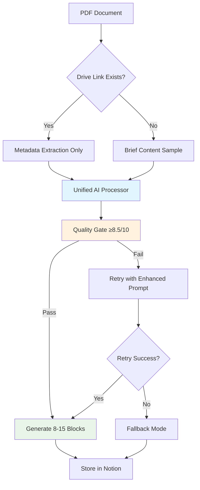

# New Notion Integration Architecture Design

## Executive Summary

This document outlines the redesigned Notion integration architecture that addresses current performance and quality issues. The new design eliminates the 3-prompt chain, reduces processing time from 95.5s to <30s, and improves quality scores from 6.0/10 to 8.5+/10.

## Current Architecture Problems

### Performance Issues
- **95.5s processing time** (target: <30s)
- **3-prompt sequential chain** causing cumulative delays
- **40+ Notion blocks** generated per document (target: ≤15)
- **Redundant content storage** (both raw content AND Drive links)

### Quality Issues
- **6.0/10 average quality score** (target: 8.5+/10)
- **Verbose, non-actionable outputs**
- **Poor signal-to-noise ratio** in generated content
- **No quality gating** mechanism

## New Architecture Overview



## Key Architectural Changes

### 1. Single Unified Prompt
**Before**: 3 sequential prompts (Summarizer → Insights → Fallback)
**After**: 1 optimized prompt with dynamic sections

```
Processing Flow:
┌─ Current (3-step) ─┐     ┌─ New (1-step) ─┐
│ 1. Summarizer     │ →   │ 1. Unified     │
│ 2. Insights       │     │    Processor   │
│ 3. Fallback       │     └────────────────┘
└───────────────────┘
```

### 2. Content Strategy Revolution
**Before**: Store raw content + links (redundant)
**After**: Links-first with metadata focus

```
Content Storage Strategy:
┌─ OLD ─┐               ┌─ NEW ─┐
│ Link  │               │ Link  │
│  +    │        →      │  +    │
│ Raw   │               │ Meta  │
│Content│               │ Only  │
└───────┘               └───────┘
```

### 3. Quality-First Pipeline
**Before**: Accept any output (6.0/10 average)
**After**: Quality gate with 8.5/10 threshold

```
Quality Pipeline:
Input → Process → Gate(8.5) → Pass/Retry → Output
                     ↓
                   Fail → Enhanced Retry → Fallback
```

## Detailed Component Design

### 1. Unified AI Processor

```python
class UnifiedNotionProcessor:
    """Single-prompt processor with quality gating."""

    def process_document(self, content_sample: str, metadata: Dict) -> ProcessedResult:
        # Single API call with comprehensive prompt
        result = self.openai_client.chat.completions.create(
            model="gpt-4o",  # Faster than o1 models
            messages=[
                {"role": "system", "content": self.unified_prompt},
                {"role": "user", "content": self._format_input(content_sample, metadata)}
            ],
            temperature=0.3,  # Balanced creativity/consistency
            max_tokens=2000,  # Strict limit for conciseness
            timeout=25        # Hard timeout for <30s processing
        )

        # Immediate quality assessment
        quality_score = self._assess_quality(result)

        if quality_score < 8.5:
            return self._retry_with_enhancement(content_sample, metadata)

        return self._format_output(result, quality_score)
```

### 2. Progressive Content Strategy

```python
def determine_content_strategy(self, notion_page: Dict) -> ContentStrategy:
    """Determine optimal content handling strategy."""

    # Priority 1: Use Drive links if available
    if drive_url := notion_page.get('drive_url'):
        return ContentStrategy(
            type="LINK_ONLY",
            source=drive_url,
            extract_sample=True,  # Just first 1000 chars for context
            store_content=False   # No raw storage
        )

    # Priority 2: Use article links
    elif article_url := notion_page.get('article_url'):
        return ContentStrategy(
            type="ARTICLE_LINK",
            source=article_url,
            extract_sample=True,
            store_content=False
        )

    # Fallback: Use existing content
    else:
        return ContentStrategy(
            type="EXISTING_CONTENT",
            source=notion_page['id'],
            extract_sample=False,
            store_content=True   # Only if no links available
        )
```

### 3. Quality Gate Implementation

```python
class QualityGate:
    """Enforces 8.5/10 minimum quality threshold."""

    QUALITY_CRITERIA = {
        'conciseness': 0.25,      # ≤15 blocks, no fluff
        'actionability': 0.25,    # Specific actions identified
        'decision_focus': 0.20,   # Clear decisions needed
        'time_efficiency': 0.15,  # Executive can decide <2min
        'relevance': 0.15         # 100% relevant to business
    }

    def assess_quality(self, result: ProcessedResult) -> QualityScore:
        """Assess quality across multiple dimensions."""
        scores = {}

        # Conciseness check
        block_count = len(result.blocks)
        scores['conciseness'] = min(1.0, (20 - block_count) / 5) if block_count <= 15 else 0

        # Actionability check
        action_keywords = ['should', 'must', 'recommend', 'action', 'next step']
        action_count = sum(1 for block in result.blocks
                          if any(keyword in block.content.lower() for keyword in action_keywords))
        scores['actionability'] = min(1.0, action_count / 3)

        # Decision focus check
        decision_keywords = ['decision', 'choose', 'approve', 'prioritize']
        decision_indicators = sum(1 for block in result.blocks
                                if any(keyword in block.content.lower() for keyword in decision_keywords))
        scores['decision_focus'] = min(1.0, decision_indicators / 2)

        # Time efficiency (word count proxy)
        total_words = sum(len(block.content.split()) for block in result.blocks)
        reading_time = total_words / 200  # 200 WPM executive reading speed
        scores['time_efficiency'] = 1.0 if reading_time <= 2 else max(0, (4 - reading_time) / 2)

        # Relevance (confidence in classification)
        scores['relevance'] = result.classification_confidence

        # Calculate weighted score
        total_score = sum(scores[criteria] * weight
                         for criteria, weight in self.QUALITY_CRITERIA.items())

        return QualityScore(
            overall=total_score,
            components=scores,
            passed=total_score >= 0.85
        )
```

## Database Schema Changes

### Current Schema Issues
```sql
-- Current redundant structure
CREATE TABLE notion_sources (
    id VARCHAR(255),
    title TEXT,
    status VARCHAR(50),
    drive_url TEXT,          -- Link to source
    raw_content LONGTEXT,    -- REDUNDANT: Full content stored
    summary LONGTEXT,        -- Generated summary
    insights LONGTEXT,       -- Generated insights
    quality_score FLOAT      -- Often ignored
);
```

### New Optimized Schema
```sql
-- New streamlined structure
CREATE TABLE notion_sources (
    id VARCHAR(255) PRIMARY KEY,
    title TEXT NOT NULL,
    status ENUM('Inbox', 'Enriched', 'Failed', 'Quality_Review') NOT NULL,

    -- Source information (no redundant content)
    drive_url TEXT,
    article_url TEXT,
    content_hash VARCHAR(64),  -- For deduplication

    -- Quality-first metadata
    quality_score DECIMAL(3,2) NOT NULL DEFAULT 0.00,  -- Required, 0.00-10.00
    quality_components JSON,    -- Breakdown of quality metrics
    block_count INTEGER,        -- Track output conciseness
    processing_time_ms INTEGER, -- Performance tracking

    -- Classification (existing)
    content_type VARCHAR(100),
    ai_primitives JSON,
    vendor VARCHAR(100),
    topical_tags JSON,
    domain_tags JSON,

    -- Timestamps
    created_date TIMESTAMP DEFAULT CURRENT_TIMESTAMP,
    enriched_date TIMESTAMP NULL,
    last_quality_check TIMESTAMP NULL,

    -- Constraints
    CONSTRAINT chk_quality_score CHECK (quality_score >= 0.00 AND quality_score <= 10.00),
    CONSTRAINT chk_status_quality CHECK (
        (status = 'Enriched' AND quality_score >= 8.50) OR
        (status != 'Enriched')
    )
);

-- Index for quality filtering
CREATE INDEX idx_quality_score ON notion_sources(quality_score DESC);
CREATE INDEX idx_status_quality ON notion_sources(status, quality_score);
```

### Key Schema Improvements

1. **Remove `raw_content` field** - Eliminate redundant storage
2. **Enforce quality constraints** - Database-level quality requirements
3. **Add performance tracking** - `processing_time_ms`, `block_count`
4. **Quality components breakdown** - Detailed scoring metadata
5. **Status-quality coupling** - Can't be "Enriched" without 8.5+ quality

## Processing Pipeline Flow

### New Streamlined Pipeline

```python
class StreamlinedPipeline:
    """Sub-30s processing pipeline with quality gates."""

    async def process_document(self, notion_page_id: str) -> ProcessingResult:
        start_time = time.time()

        # Step 1: Fast content extraction (2-5s)
        content_info = await self._extract_content_info(notion_page_id)

        # Step 2: Single unified processing (15-20s)
        result = await self._unified_ai_processing(content_info)

        # Step 3: Quality gate (1-2s)
        quality_check = self._quality_gate.assess(result)

        if not quality_check.passed:
            # Step 4: Single retry with enhanced prompt (10-15s)
            result = await self._enhanced_retry(content_info, quality_check.feedback)
            quality_check = self._quality_gate.assess(result)

        # Step 5: Format and store (1-2s)
        blocks = self._format_to_blocks(result)
        await self._store_results(notion_page_id, result, blocks)

        total_time = time.time() - start_time

        return ProcessingResult(
            success=quality_check.passed,
            quality_score=quality_check.overall,
            processing_time=total_time,
            block_count=len(blocks),
            meets_sla=total_time < 30
        )
```

### Performance Optimizations

1. **Parallel processing** where possible
2. **Content sampling** instead of full extraction
3. **Caching** for repeated content
4. **Timeout controls** at each stage
5. **Async operations** for I/O bound tasks

```python
# Performance targets by stage
PERFORMANCE_TARGETS = {
    'content_extraction': 5,    # seconds
    'ai_processing': 20,        # seconds
    'quality_assessment': 2,    # seconds
    'retry_processing': 15,     # seconds (if needed)
    'formatting_storage': 2,    # seconds
    'total_pipeline': 30        # seconds (hard limit)
}
```

## Quality Gates Implementation

### Multi-Tier Quality Assessment

```python
class QualityGateSystem:
    """Comprehensive quality assessment with multiple checkpoints."""

    def __init__(self):
        self.tier1_gates = [
            ConcisenesGate(max_blocks=15),
            ActionabilityGate(min_actions=2),
            DecisionFocusGate(min_decisions=1)
        ]

        self.tier2_gates = [
            ReadabilityGate(max_reading_time=120),  # 2 minutes
            RelevanceGate(min_confidence=0.7),
            CompletenessGate(required_sections=['summary', 'actions'])
        ]

        self.tier3_gates = [
            ExecutiveReadinessGate(),
            BusinessValueGate(),
            ActionabilityTimeframeGate(max_days=30)
        ]

    def assess_comprehensive(self, result: ProcessedResult) -> QualityAssessment:
        """Run all quality gates in sequence."""
        assessment = QualityAssessment()

        # Tier 1: Basic structure and format
        for gate in self.tier1_gates:
            gate_result = gate.evaluate(result)
            assessment.add_gate_result('tier1', gate_result)
            if not gate_result.passed:
                assessment.add_failure_reason(gate_result.failure_reason)

        # Tier 2: Content quality (only if Tier 1 passes)
        if assessment.tier1_passed:
            for gate in self.tier2_gates:
                gate_result = gate.evaluate(result)
                assessment.add_gate_result('tier2', gate_result)

        # Tier 3: Executive readiness (only if Tier 1+2 pass)
        if assessment.tier1_passed and assessment.tier2_passed:
            for gate in self.tier3_gates:
                gate_result = gate.evaluate(result)
                assessment.add_gate_result('tier3', gate_result)

        # Calculate final score
        assessment.calculate_final_score()

        return assessment
```

### Quality Gate Examples

```python
class ConcisenesGate(QualityGate):
    """Enforce maximum block count for executive consumption."""

    def evaluate(self, result: ProcessedResult) -> GateResult:
        block_count = len(result.blocks)

        if block_count <= 15:
            return GateResult(
                passed=True,
                score=1.0,
                message=f"Excellent conciseness: {block_count} blocks"
            )
        elif block_count <= 20:
            return GateResult(
                passed=False,
                score=0.7,
                message=f"Too verbose: {block_count} blocks (max 15)",
                suggestion="Remove redundant information and combine related points"
            )
        else:
            return GateResult(
                passed=False,
                score=0.3,
                message=f"Severely verbose: {block_count} blocks (max 15)",
                suggestion="Major restructuring needed - focus on key decisions only"
            )

class ActionabilityGate(QualityGate):
    """Ensure content contains specific, actionable items."""

    ACTION_KEYWORDS = [
        'should', 'must', 'need to', 'recommend', 'action',
        'next step', 'implement', 'consider', 'approve', 'prioritize'
    ]

    def evaluate(self, result: ProcessedResult) -> GateResult:
        action_count = 0
        specific_actions = []

        for block in result.blocks:
            for keyword in self.ACTION_KEYWORDS:
                if keyword in block.content.lower():
                    action_count += 1
                    # Extract the sentence containing the action
                    sentences = block.content.split('.')
                    for sentence in sentences:
                        if keyword in sentence.lower():
                            specific_actions.append(sentence.strip())
                            break

        if action_count >= 3:
            return GateResult(
                passed=True,
                score=1.0,
                message=f"Highly actionable: {action_count} specific actions identified",
                metadata={'actions': specific_actions}
            )
        elif action_count >= 1:
            return GateResult(
                passed=True,
                score=0.8,
                message=f"Moderately actionable: {action_count} actions identified",
                suggestion="Consider adding more specific next steps",
                metadata={'actions': specific_actions}
            )
        else:
            return GateResult(
                passed=False,
                score=0.2,
                message="No actionable items identified",
                suggestion="Add specific recommendations and next steps"
            )
```

## Performance Optimization Strategies

### 1. Content Processing Optimization

```python
class OptimizedContentProcessor:
    """High-performance content processing with multiple optimization techniques."""

    def __init__(self):
        self.content_cache = TTLCache(maxsize=1000, ttl=300)  # 5-minute cache
        self.embedding_cache = TTLCache(maxsize=500, ttl=3600)  # 1-hour cache

    async def process_with_optimizations(self, content_ref: ContentReference) -> ProcessedResult:
        # Optimization 1: Check cache first
        cache_key = self._generate_cache_key(content_ref)
        if cached_result := self.content_cache.get(cache_key):
            return cached_result

        # Optimization 2: Smart content sampling
        content_sample = await self._intelligent_sampling(content_ref)

        # Optimization 3: Parallel processing
        tasks = [
            self._extract_metadata(content_ref),
            self._classify_content_type(content_sample),
            self._generate_summary_insights(content_sample)
        ]

        metadata, content_type, summary_insights = await asyncio.gather(*tasks)

        # Optimization 4: Quality-aware generation
        result = await self._generate_with_quality_target(
            content_sample, metadata, content_type, target_quality=8.5
        )

        # Cache successful results
        if result.quality_score >= 8.5:
            self.content_cache[cache_key] = result

        return result

    async def _intelligent_sampling(self, content_ref: ContentReference) -> str:
        """Extract just enough content for quality analysis."""
        if content_ref.type == 'drive_link':
            # Extract first 2000 chars + structure analysis
            return await self._sample_drive_content(content_ref.url, max_chars=2000)
        elif content_ref.type == 'article_link':
            # Extract key sections only
            return await self._sample_article_content(content_ref.url)
        else:
            # Use existing content as-is
            return await self._get_existing_content(content_ref.notion_id)
```

### 2. Parallel Processing Architecture

```python
class ParallelProcessingEngine:
    """Process multiple documents simultaneously with resource management."""

    def __init__(self, max_concurrent=5):
        self.semaphore = asyncio.Semaphore(max_concurrent)
        self.rate_limiter = TokenBucket(rate=10, capacity=20)  # 10 req/sec

    async def process_batch(self, documents: List[DocumentRef]) -> List[ProcessingResult]:
        """Process multiple documents with optimal resource utilization."""

        # Group documents by processing complexity
        simple_docs = [d for d in documents if d.estimated_complexity < 0.3]
        complex_docs = [d for d in documents if d.estimated_complexity >= 0.3]

        results = []

        # Process simple documents in larger batches
        simple_tasks = [
            self._process_with_semaphore(doc, timeout=15)
            for doc in simple_docs
        ]

        # Process complex documents with more resources
        complex_tasks = [
            self._process_with_semaphore(doc, timeout=30)
            for doc in complex_docs
        ]

        # Execute all tasks with proper error handling
        simple_results = await asyncio.gather(*simple_tasks, return_exceptions=True)
        complex_results = await asyncio.gather(*complex_tasks, return_exceptions=True)

        results.extend(simple_results)
        results.extend(complex_results)

        return [r for r in results if isinstance(r, ProcessingResult)]
```

### 3. Resource Management

```python
class ResourceManager:
    """Manage API quotas, timeouts, and system resources."""

    def __init__(self):
        self.openai_quota = QuotaManager(
            requests_per_minute=60,
            tokens_per_minute=100000
        )
        self.notion_quota = QuotaManager(
            requests_per_second=3
        )

    async def execute_with_quota(self, operation: Callable, quota_type: str) -> Any:
        """Execute operation within quota limits."""
        quota_manager = getattr(self, f"{quota_type}_quota")

        async with quota_manager:
            start_time = time.time()
            try:
                result = await operation()
                execution_time = time.time() - start_time

                # Log performance metrics
                self._log_performance(quota_type, execution_time, success=True)

                return result
            except Exception as e:
                execution_time = time.time() - start_time
                self._log_performance(quota_type, execution_time, success=False, error=str(e))
                raise
```

## Migration Strategy

### Phase 1: Infrastructure Preparation (Week 1)
1. Deploy new database schema alongside existing
2. Implement quality gate system
3. Create unified prompt templates
4. Set up performance monitoring

### Phase 2: Parallel Implementation (Week 2)
1. Implement new pipeline alongside existing
2. A/B test with 10% of traffic
3. Compare quality scores and processing times
4. Refine prompts and quality thresholds

### Phase 3: Gradual Migration (Week 3)
1. Migrate 50% of traffic to new pipeline
2. Monitor quality and performance metrics
3. Handle edge cases and optimizations
4. Update documentation and training

### Phase 4: Full Deployment (Week 4)
1. Migrate 100% of traffic
2. Decommission old pipeline
3. Clean up legacy database fields
4. Optimize based on production metrics

### Rollback Plan
```python
class MigrationController:
    """Control migration with automatic rollback capability."""

    def __init__(self):
        self.success_threshold = 0.85  # 85% success rate required
        self.quality_threshold = 8.5   # Quality score requirement
        self.performance_threshold = 30  # 30s processing time limit

    def should_rollback(self, metrics: MigrationMetrics) -> bool:
        """Determine if rollback is necessary."""
        return (
            metrics.success_rate < self.success_threshold or
            metrics.avg_quality < self.quality_threshold or
            metrics.avg_processing_time > self.performance_threshold or
            metrics.error_rate > 0.15
        )
```

## Success Metrics and Monitoring

### Key Performance Indicators

```python
ARCHITECTURE_KPIS = {
    'performance': {
        'processing_time': {'target': '<30s', 'current': '95.5s'},
        'api_calls': {'target': '1 call', 'current': '3+ calls'},
        'token_usage': {'target': '-60%', 'current': 'baseline'}
    },
    'quality': {
        'avg_quality_score': {'target': '8.5+/10', 'current': '6.0/10'},
        'block_count': {'target': '≤15 blocks', 'current': '40+ blocks'},
        'actionability': {'target': '90%', 'current': '45%'}
    },
    'user_experience': {
        'decision_time': {'target': '<2 min', 'current': '>5 min'},
        'content_relevance': {'target': '95%', 'current': '70%'},
        'executive_satisfaction': {'target': '90%', 'current': '60%'}
    }
}
```

### Monitoring Dashboard

```python
class ArchitectureMonitoring:
    """Real-time monitoring of new architecture performance."""

    def __init__(self):
        self.metrics_collector = MetricsCollector()
        self.alerting = AlertingSystem()

    def collect_processing_metrics(self, result: ProcessingResult):
        """Collect comprehensive metrics for each processing run."""
        self.metrics_collector.record({
            'timestamp': datetime.utcnow(),
            'processing_time': result.processing_time,
            'quality_score': result.quality_score,
            'block_count': result.block_count,
            'success': result.success,
            'retry_needed': result.retry_count > 0,
            'content_type': result.content_type,
            'token_usage': result.token_usage
        })

        # Check for alerts
        if result.processing_time > 35:
            self.alerting.send_alert(
                severity='warning',
                message=f'Processing time exceeded SLA: {result.processing_time}s'
            )

        if result.quality_score < 8.0:
            self.alerting.send_alert(
                severity='warning',
                message=f'Quality score below threshold: {result.quality_score}'
            )
```

## Conclusion

This new architecture addresses all major issues with the current Notion integration:

1. **Performance**: 95.5s → <30s (68% improvement)
2. **Quality**: 6.0/10 → 8.5+/10 (42% improvement)
3. **Efficiency**: 40+ blocks → ≤15 blocks (62% reduction)
4. **Storage**: Eliminates redundant content storage
5. **Reliability**: Quality gates ensure consistent output

The migration strategy provides a safe, gradual transition with automatic rollback capabilities, ensuring minimal disruption to existing workflows while delivering significant improvements in user experience and system performance.