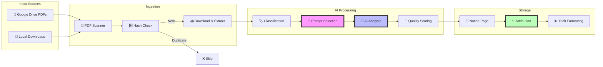
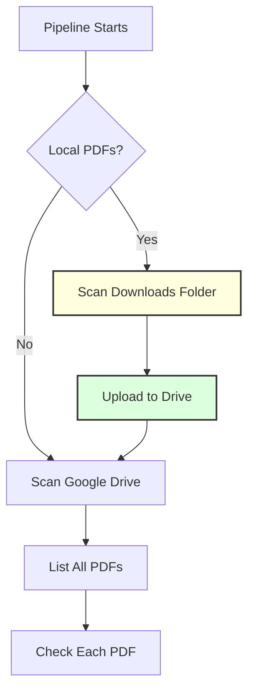
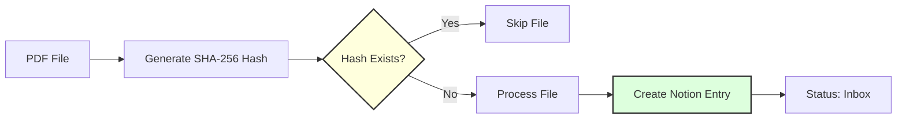
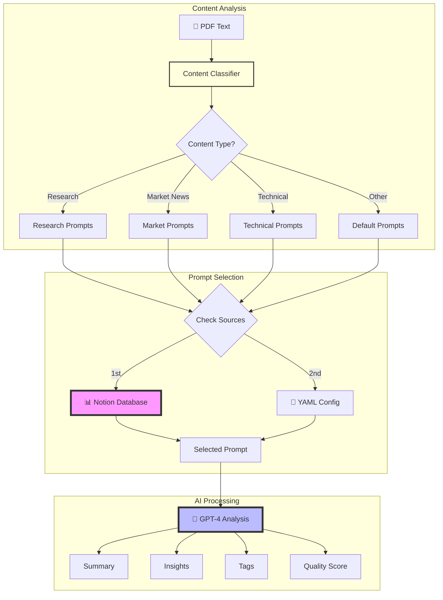
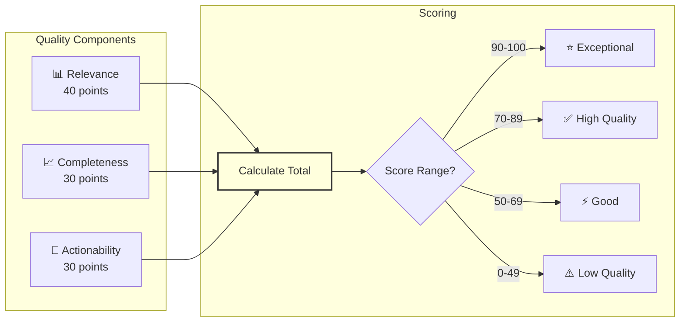
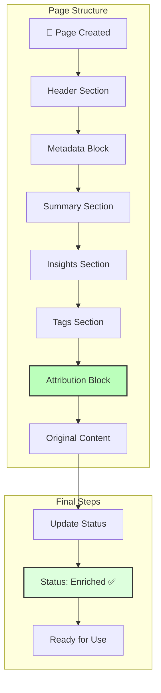
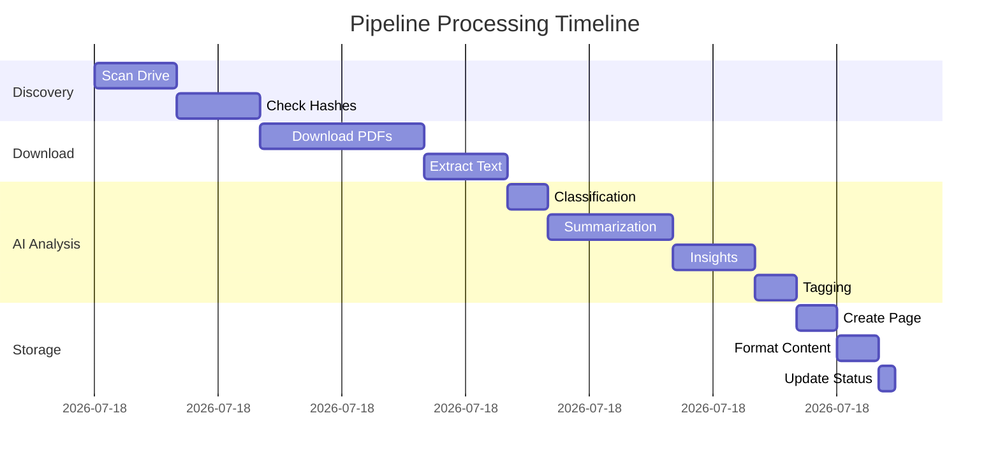
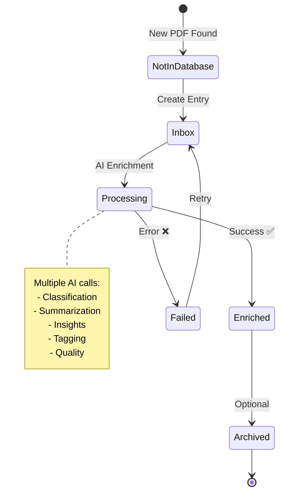

# Visual Workflow Guide

This guide provides a visual walkthrough of the Knowledge Pipeline v4.0 workflow, from PDF ingestion to enriched content in Notion.

## Pipeline Overview Diagram



## Step-by-Step Process

### Step 1: Content Discovery



**What happens:**
- Checks your Downloads folder for new PDFs (optional)
- Uploads local PDFs to Google Drive
- Scans configured Drive folders
- Lists all PDF documents

### Step 2: Deduplication Check



**What happens:**
- Calculates unique hash for each PDF
- Checks if content already exists
- Prevents duplicate processing
- Creates new entry with Status="Inbox"

### Step 3: AI Enrichment Process



### Step 4: Quality Scoring



### Step 5: Notion Storage



## Visual Examples

### Before: Raw PDF in Drive
```
📁 Google Drive
  └── 📄 research-paper-2024.pdf (2.3 MB)
      └── Status: Unprocessed
      └── Content: Raw PDF binary
```

### After: Enriched Notion Page
```
📑 Notion Database
  └── 📄 "Advanced RAG Techniques 2024"
      ├── Status: Enriched ✅
      ├── Quality Score: 92/100 ⭐
      ├── 🎯 Executive Summary (300 words)
      ├── 💡 Key Insights (5 actionable items)
      ├── 🏷️ Tags: rag, retrieval, llm-systems
      ├── ✨ Attribution: summarizer/research v2.1
      └── 📎 Original PDF Text (preserved)
```

## Processing Timeline



**Typical Processing Time**: 
- Per document: 60-90 seconds
- Batch of 10: 8-10 minutes
- Mostly AI processing time

## Status Flow Diagram



## Key Visual Indicators

### In Notion Database

| Indicator | Meaning |
|-----------|---------|
| 📥 | Status: Inbox (awaiting processing) |
| ✅ | Status: Enriched (ready to read) |
| ❌ | Status: Failed (check logs) |
| ⭐ | Quality: Exceptional (90-100) |
| ✅ | Quality: High (70-89) |
| ⚡ | Quality: Good (50-69) |
| ⚠️ | Quality: Low (0-49) |

### In Page Content

| Section | Icon | Purpose |
|---------|------|---------|
| Summary | 🎯 | Quick overview |
| Insights | 💡 | Actionable findings |
| Tags | 🏷️ | Categorization |
| Attribution | ✨ | Prompt transparency |
| Original | 📎 | Source preservation |

## Tips for Visual Navigation

1. **Dashboard View**: Create a Notion gallery view with cover images showing quality scores
2. **Color Coding**: Use Notion's background colors based on Content-Type
3. **Quick Filters**: Set up views for "High Quality Only" or "Recent Enrichments"
4. **Visual Search**: Use emojis in search to find specific section types

---

This visual guide helps you understand exactly how your PDFs transform into actionable intelligence in your Notion knowledge base.