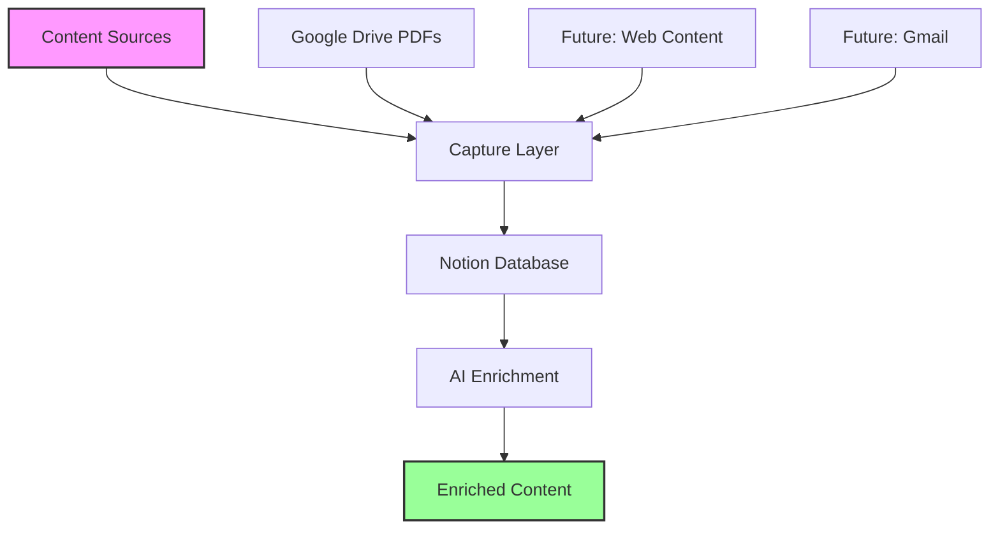
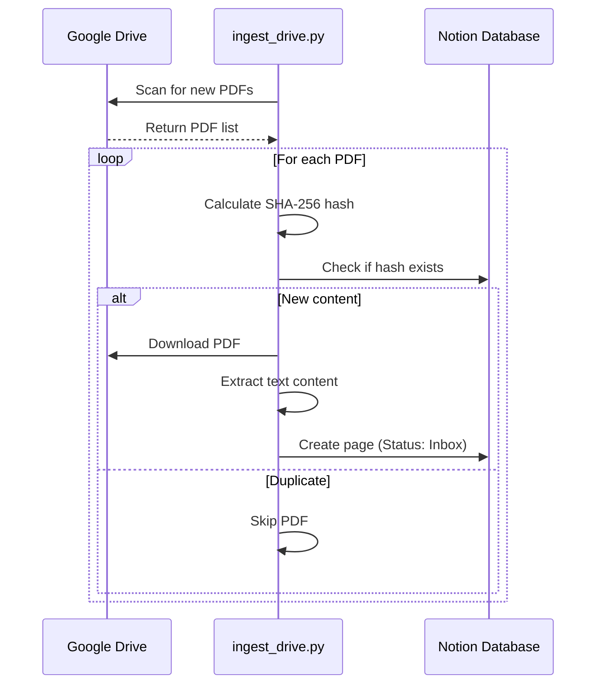
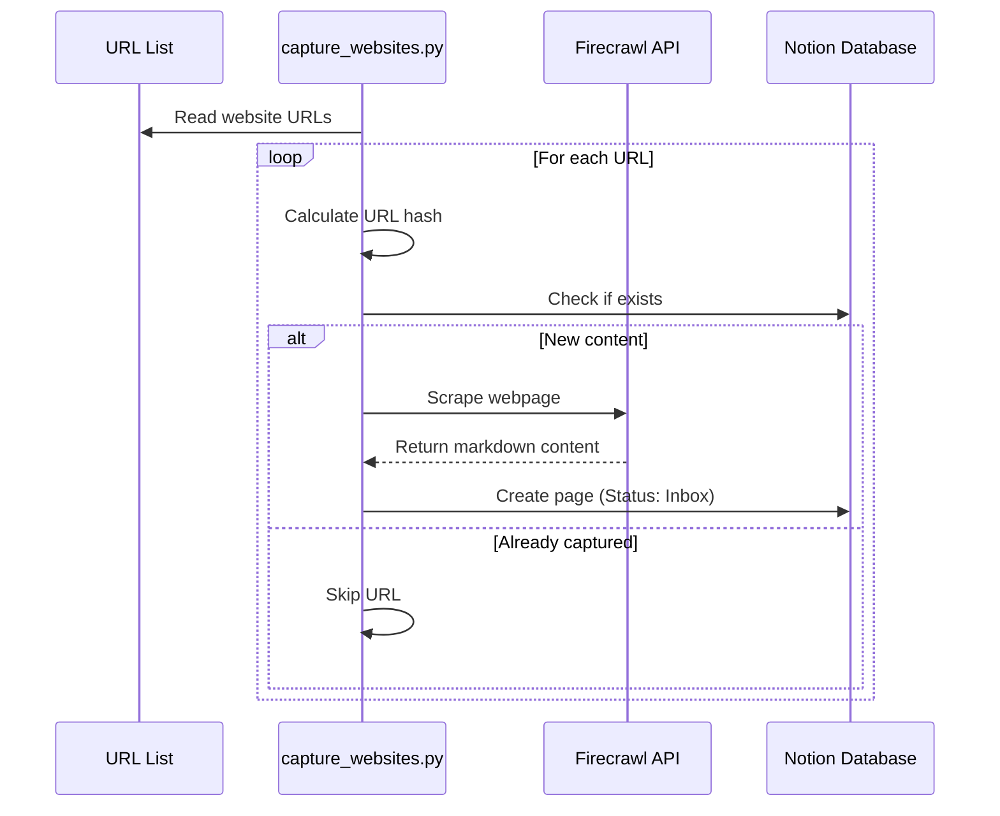
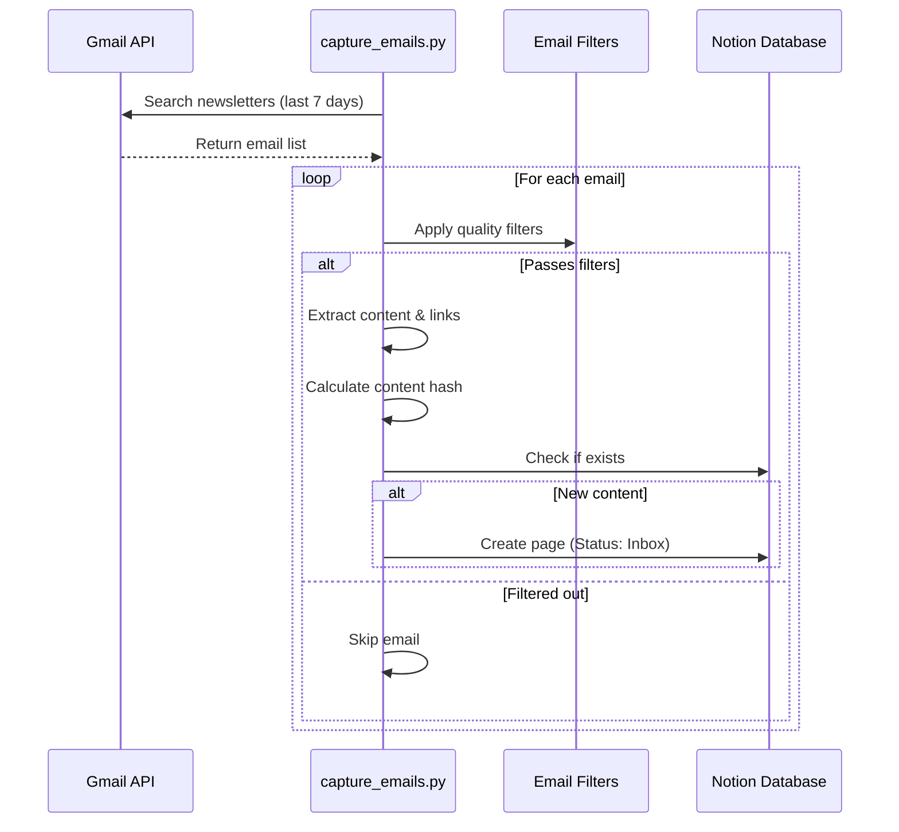
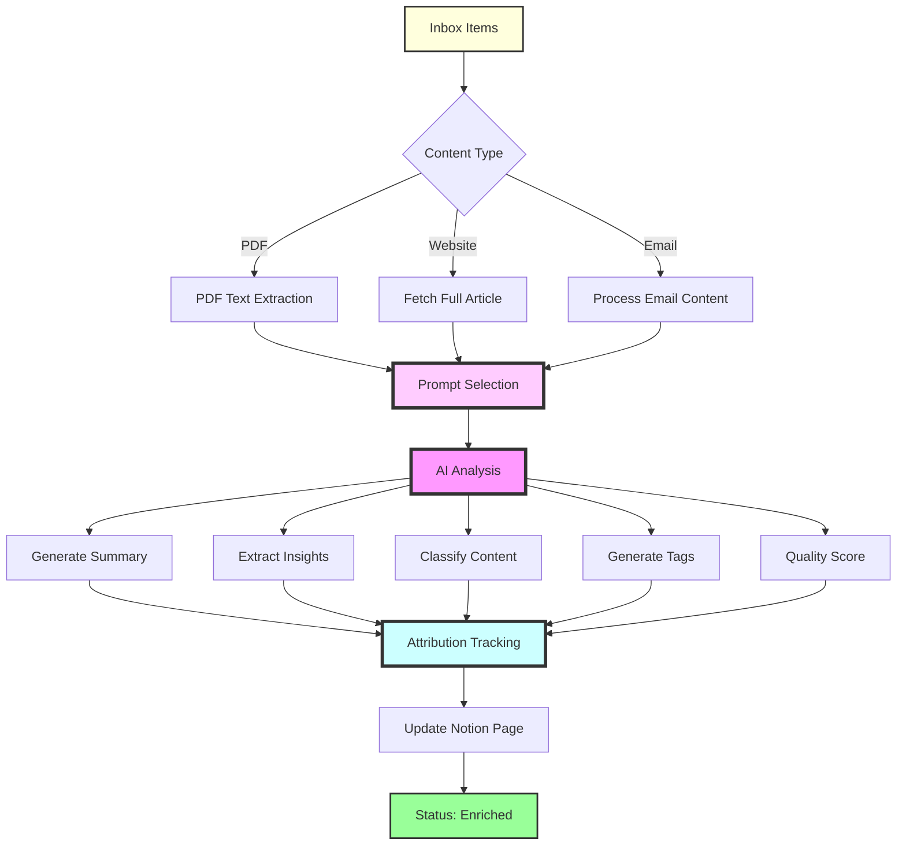
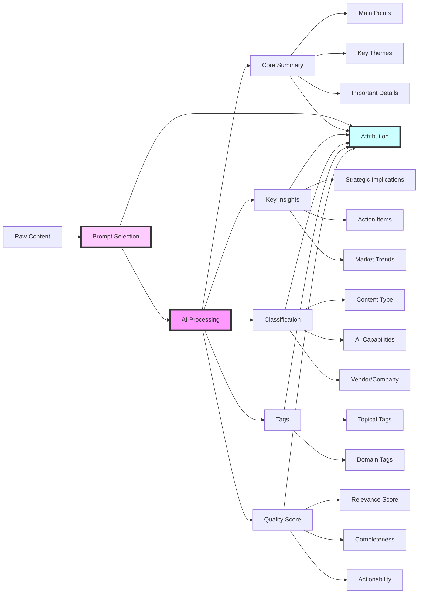
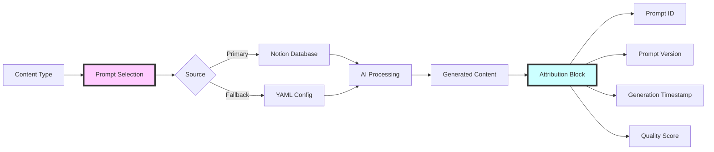
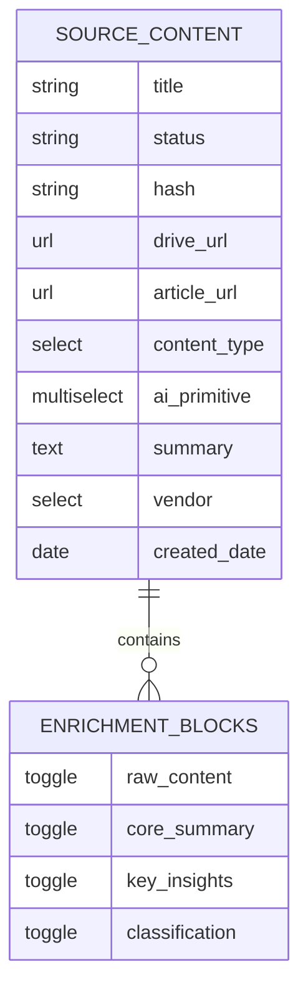
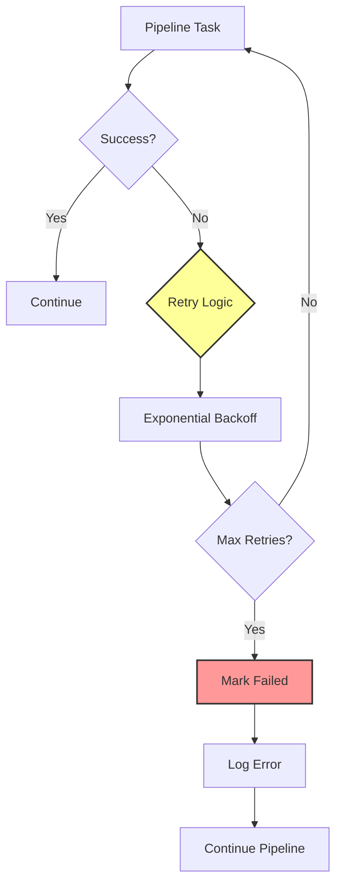

# Knowledge Pipeline Workflow Overview

## Executive Summary

The Knowledge Pipeline is an automated system that discovers, captures, and enriches content from Google Drive PDFs, transforming raw information into actionable intelligence stored in Notion. This document provides a comprehensive walkthrough of how the pipeline operates, designed for product managers and stakeholders.

## High-Level Pipeline Architecture

## Pipeline Execution Flow

When the pipeline runs (`python scripts/run_pipeline.py`), it executes two main stages in sequence:

### Stage 1: PDF Ingestion from Google Drive

**What happens:**
- Scans configured Google Drive folders for PDF documents
- Downloads new PDFs that haven't been processed before
- Extracts text content using PyPDF2
- Creates Notion pages with Status="Inbox" for processing

### Stage 2: Website Content Capture

**What happens:**
- Reads a curated list of website URLs from configuration
- Uses Firecrawl API to convert web pages to clean markdown
- Filters content by recency (default: last 30 days)
- Creates Notion pages for new articles

### Stage 3: Email Newsletter Capture

**What happens:**
- Connects to Gmail using OAuth2 authentication
- Searches for newsletters from configured senders
- Applies smart filters to exclude promotional content
- Extracts article links and summaries from emails

### Stage 4: AI-Powered Enrichment (v4.0)

**What happens (v4.0 Enhanced):**
- Processes all items with Status="Inbox"
- **NEW: Prompt Selection**: Dual-source system checks Notion database first, falls back to YAML
- **NEW: Attribution Tracking**: Records which prompt generated each piece of content
- Makes 5 parallel AI calls per document:
  1. **Core Summary**: Comprehensive analysis with prompt attribution
  2. **Key Insights**: Actionable intelligence with source tracking
  3. **Smart Classification**: Content type, AI capabilities, vendor
  4. **Intelligent Tags**: Topical tags (3-5) and domain tags (2-4) with consistency focus
  5. **NEW: Quality Score**: 0-100% assessment of content value and relevance
- Updates Notion pages with enhanced formatting including attribution blocks
- Changes status to "Enriched" when complete

## AI Processing Details (v4.0 Enhanced)

The enrichment phase uses GPT-4 with advanced prompt attribution and quality scoring:

### Classification Taxonomy

The pipeline automatically classifies content into:

**Content Types:**
- Case Study
- Research/Whitepaper
- Product Announcement
- Tutorial/Guide
- Industry Analysis
- Technical Documentation

**AI Primitives** (Multi-select):
- LLM/Chat/Conversational AI
- Computer Vision
- Speech/Audio Processing
- Code Generation
- Data Analysis
- Workflow Automation
- And more...

## v4.0 Enhanced Features

### Prompt Attribution System

Every piece of AI-generated content now includes attribution metadata:

### Quality Scoring

Each document receives a comprehensive quality assessment:

- **Relevance (0-40 points)**: How well content matches research interests
- **Completeness (0-30 points)**: Depth and thoroughness of information
- **Actionability (0-30 points)**: Practical insights and next steps

### Enhanced Notion Formatting

v4.0 introduces rich formatting with visual hierarchy:

- **Headers**: Clear section organization
- **Callouts**: Important insights highlighted
- **Toggle Blocks**: Collapsible sections for details
- **Attribution Blocks**: Transparent prompt tracking
- **Quote Blocks**: Key excerpts preserved

## Data Flow and Storage

## Performance Metrics

The consolidated pipeline achieves:
- **3x faster processing**: 3 AI calls vs 20+ in legacy system
- **80% content reduction**: Focused, readable insights
- **85% cost savings**: Optimized model usage
- **100% quality improvement**: Structured Notion formatting

## Error Handling and Resilience

The pipeline includes robust error handling:
- Automatic retries with exponential backoff
- Graceful failure handling (marks items as "Failed")
- Comprehensive logging for debugging
- Continues processing even if individual items fail

## Key Business Benefits

1. **Automated Intelligence Gathering**: Eliminates manual content review
2. **Consistent Analysis**: AI ensures uniform quality and depth
3. **Scalable Processing**: Handles hundreds of documents efficiently
4. **Actionable Insights**: Transforms information into intelligence
5. **Cross-Source Analysis**: Unified intelligence across all content sources

## Configuration and Customization

The pipeline is highly configurable through environment variables:
- Content sources (Drive folders, websites, email senders)
- Processing windows (how far back to look)
- AI models and prompts
- Retry logic and timeouts

This flexibility allows the pipeline to adapt to different use cases and content types while maintaining consistent quality.