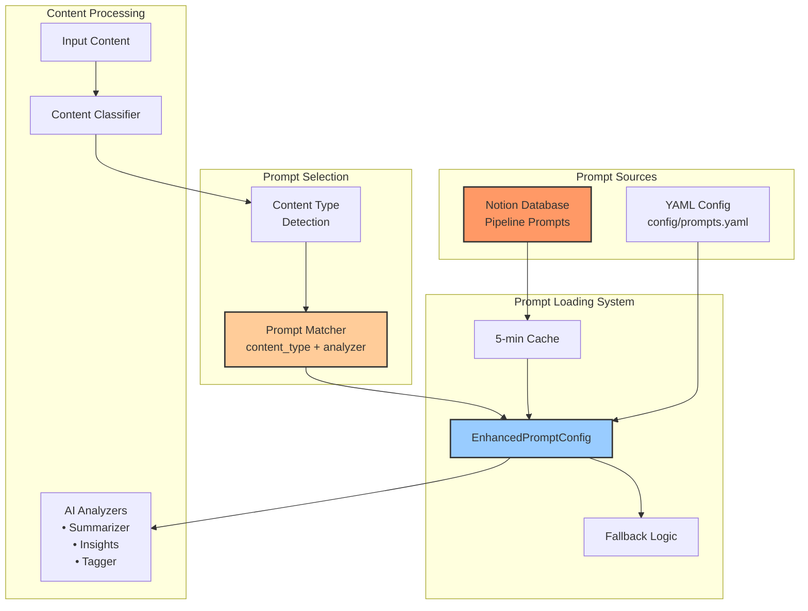
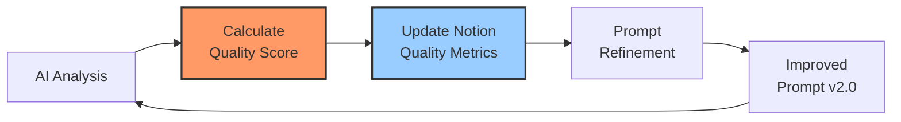

# Notion Prompt Management System Diagram

## Overview

The Knowledge Pipeline uses a sophisticated prompt management system that combines YAML-based defaults with dynamic Notion database overrides. This document provides a comprehensive view of how prompts are defined, stored, retrieved, and applied.

## System Architecture



## Notion Database Structure

### Database Schema: Pipeline Prompts

```
┌─────────────────────────────────────────────────────────────────────┐
│                        Pipeline Prompts Database                      │
├─────────────────────┬───────────────┬─────────────────────────────────┤
│ Property            │ Type          │ Description                     │
├─────────────────────┼───────────────┼─────────────────────────────────┤
│ Content Type        │ Select        │ Research, Vendor Capability,    │
│                     │               │ Market News, etc.               │
├─────────────────────┼───────────────┼─────────────────────────────────┤
│ Analyzer Type       │ Select        │ summarizer, classifier,         │
│                     │               │ insights, tagger                │
├─────────────────────┼───────────────┼─────────────────────────────────┤
│ System Prompt       │ Rich Text     │ Main prompt template            │
├─────────────────────┼───────────────┼─────────────────────────────────┤
│ Formatting          │ Rich Text     │ Output formatting instructions  │
│ Instructions        │               │                                 │
├─────────────────────┼───────────────┼─────────────────────────────────┤
│ Temperature         │ Number        │ 0.1 - 0.9 (AI creativity)      │
├─────────────────────┼───────────────┼─────────────────────────────────┤
│ Web Search          │ Checkbox      │ Enable/disable web search       │
├─────────────────────┼───────────────┼─────────────────────────────────┤
│ Active              │ Checkbox      │ Enable/disable prompt           │
├─────────────────────┼───────────────┼─────────────────────────────────┤
│ Version             │ Number        │ Prompt version (1.0, 2.0, etc.) │
├─────────────────────┼───────────────┼─────────────────────────────────┤
│ Usage Count         │ Number        │ Times prompt has been used      │
├─────────────────────┼───────────────┼─────────────────────────────────┤
│ Quality Score       │ Number        │ Average quality (0-5)           │
└─────────────────────┴───────────────┴─────────────────────────────────┘
```

## Prompt Selection Logic

```mermaid
flowchart TD
    Start[Content Input] --> ClassifyContent[Classify Content Type]
    ClassifyContent --> DetermineType{Semantic Content Type?}
    
    DetermineType -->|Research| Research[content_type = 'research']
    DetermineType -->|Vendor Doc| Vendor[content_type = 'vendor_capability']
    DetermineType -->|News| Market[content_type = 'market_news']
    DetermineType -->|Other| Other[content_type = 'other']
    
    Research --> SelectAnalyzer[Select Analyzer Type]
    Vendor --> SelectAnalyzer
    Market --> SelectAnalyzer
    Other --> SelectAnalyzer
    
    SelectAnalyzer --> BuildKey[Build Cache Key:<br/>'{content_type}_{analyzer}']
    
    BuildKey --> CheckNotion{Notion DB<br/>Available?}
    
    CheckNotion -->|Yes| CheckCache{In Cache?<br/><5 min old}
    CheckNotion -->|No| UseYAML[Use YAML Prompt]
    
    CheckCache -->|Yes| UseNotionCached[Use Cached<br/>Notion Prompt]
    CheckCache -->|No| QueryNotion[Query Notion DB]
    
    QueryNotion --> FoundInNotion{Found &<br/>Active?}
    FoundInNotion -->|Yes| CacheAndUse[Cache & Use<br/>Notion Prompt]
    FoundInNotion -->|No| UseYAML
    
    CacheAndUse --> ApplyPrompt[Apply Prompt<br/>to Analyzer]
    UseNotionCached --> ApplyPrompt
    UseYAML --> ApplyPrompt
    
    ApplyPrompt --> GenerateOutput[Generate AI Output]
    
    style CheckNotion fill:#f96,stroke:#333,stroke-width:2px
    style BuildKey fill:#9cf,stroke:#333,stroke-width:2px
    style ApplyPrompt fill:#fc9,stroke:#333,stroke-width:2px
```

## Prompt Application Process

### 1. Content Classification
```python
# First, classify the content semantically
classification = classifier.classify_content(content, title)
semantic_content_type = classification.get("content_type", "Other")
# Example: "Research", "Vendor Capability", "Market News"
```

### 2. Prompt Retrieval
```python
# Build cache key from content type and analyzer
cache_key = f"{content_type.lower().replace(' ', '_')}_{analyzer}"
# Example: "research_summarizer", "vendor_capability_insights"

# Check Notion cache first, then fallback to YAML
prompt = prompt_config.get_prompt(analyzer, semantic_content_type)
```

### 3. Prompt Structure
```yaml
# Each prompt contains:
{
    "system": "Full system prompt with formatting instructions",
    "temperature": 0.3,
    "web_search": false,
    "version": 2.0,
    "source": "notion" | "yaml"
}
```

## Content Type Mapping

```
┌─────────────────────┬─────────────────────┬─────────────────────┐
│ Notion Database     │ Normalized Key      │ Use Cases           │
├─────────────────────┼─────────────────────┼─────────────────────┤
│ Research            │ research            │ Academic papers,    │
│                     │                     │ studies, reports    │
├─────────────────────┼─────────────────────┼─────────────────────┤
│ Vendor Capability   │ vendor_capability   │ Product docs,       │
│                     │                     │ feature releases    │
├─────────────────────┼─────────────────────┼─────────────────────┤
│ Market News         │ market_news         │ Industry news,      │
│                     │                     │ market analysis     │
├─────────────────────┼─────────────────────┼─────────────────────┤
│ Thought Leadership  │ thought_leadership  │ Opinion pieces,     │
│                     │                     │ vision documents    │
├─────────────────────┼─────────────────────┼─────────────────────┤
│ Client Deliverable  │ client_deliverable  │ Reports,            │
│                     │                     │ presentations       │
├─────────────────────┼─────────────────────┼─────────────────────┤
│ Personal Note       │ personal_note       │ Meeting notes,      │
│                     │                     │ observations        │
└─────────────────────┴─────────────────────┴─────────────────────┘
```

## Quality Feedback Loop



## Key Features

### 1. Dynamic Prompt Management
- **Live Updates**: Changes in Notion reflect after 5-minute cache expiry
- **Version Control**: Track prompt versions and rollback if needed
- **A/B Testing**: Run multiple prompt versions simultaneously

### 2. Intelligent Fallback System
```
Priority Order:
1. Notion prompt (if available and active)
2. YAML prompt for specific content type
3. YAML default prompt for analyzer
4. Hardcoded fallback prompt
```

### 3. Performance Optimization
- **5-minute cache**: Reduces Notion API calls
- **Batch loading**: All prompts loaded in single query
- **Error resilience**: Falls back to YAML after 3 consecutive Notion errors

### 4. Quality Tracking
- **Usage counting**: Track how often each prompt is used
- **Quality scoring**: Average quality score per prompt
- **Performance metrics**: Processing time per prompt/content type

## Configuration Examples

### Environment Variables
```bash
# Enable Notion prompt management
NOTION_API_KEY=secret_xxx
NOTION_PROMPTS_DB_ID=abc123def456

# Enable enhanced features
USE_ENHANCED_PROMPTS=true
ENABLE_WEB_SEARCH=true
```

### YAML Fallback Structure
```yaml
defaults:
  summarizer:
    system: "Default summarizer prompt..."
    temperature: 0.3
    web_search: false

content_types:
  research:
    summarizer:
      system: "Research-specific prompt..."
      web_search: true
```

### Notion Entry Example
```
Content Type: Research
Analyzer Type: summarizer
System Prompt: "You are a research intelligence analyst..."
Temperature: 0.4
Web Search: ✓
Active: ✓
Version: 2.0
```

## Benefits of This Architecture

1. **Flexibility**: Update prompts without code deployment
2. **Experimentation**: Test new prompts easily
3. **Performance**: Caching prevents API overload
4. **Reliability**: Multiple fallback layers
5. **Insights**: Track what works through quality metrics
6. **Scalability**: Add new content types and analyzers easily

## Summary

The Notion-based prompt management system provides a powerful, flexible way to manage AI prompts for the Knowledge Pipeline. By combining dynamic Notion storage with YAML fallbacks and intelligent caching, the system achieves both flexibility and reliability while maintaining high performance.