# Notion Integration Prompt Optimization

## Problem Analysis

### Current Issues
- **Bloated Output**: 40+ blocks per page (target: ≤15 blocks)
- **Low Quality**: 6.0/10 score (target: 8.5/10)
- **Slow Processing**: 95.5 seconds (inefficient chain)
- **Redundancy**: 3-prompt chain with duplicated content
- **Poor UX**: Raw content when Drive links exist

### Root Causes
1. **Verbose prompts** generate unnecessary detail
2. **Chained processing** compounds verbosity
3. **No progressive disclosure** strategy
4. **Missing output constraints** allow bloat
5. **Duplicate content generation** wastes tokens

---

## 1. Ultra-Concise Summarizer Prompt

### Prompt: `NOTION_SUMMARIZER_V2`

```
ROLE: Executive briefing specialist
TASK: Create ultra-concise document summary for busy decision-makers

INPUT: Document content and metadata
OUTPUT: Exactly 3-5 Notion blocks maximum

CONSTRAINTS:
- MAX 3-5 blocks total
- NO raw content reproduction
- Focus on decisions/actions needed
- Use bullet points, not paragraphs
- Include confidence score (1-10)

FORMAT:
Block 1: 📄 **Key Points** (3-4 bullets max)
Block 2: 🎯 **Action Items** (2-3 bullets max)
Block 3: 📊 **Metadata** (Source, Date, Confidence)
[Optional Block 4: ⚠️ **Risks/Concerns** (if critical)]
[Optional Block 5: 🔗 **Related Links** (if available)]

EXAMPLES:
✅ GOOD: "• Revenue increased 15% QoQ • New market expansion needed • Budget approval required by Q2"
❌ BAD: "The quarterly financial report shows that our revenue has increased by fifteen percent..."

QUALITY CHECKS:
- Can executive make decision in <60 seconds?
- Are action items specific and assignable?
- Is confidence score justified?
- Zero redundant information?

Variables: {{document_type}}, {{urgency_level}}, {{target_audience}}
```

---

## 2. Action-Oriented Insights Prompt

### Prompt: `NOTION_INSIGHTS_V2`

```
ROLE: Strategic analyst
TASK: Extract high-value insights for immediate action

INPUT: Document content and business context
OUTPUT: Exactly 4-6 Notion blocks maximum

CONSTRAINTS:
- MAX 4-6 blocks total
- Insights must be actionable within 30 days
- Include impact assessment (High/Medium/Low)
- No theoretical analysis
- Confidence level required

FORMAT:
Block 1: 💡 **Key Insights** (3-4 insights max, impact level)
Block 2: 📈 **Opportunities** (2-3 specific opportunities)
Block 3: ⚡ **Quick Wins** (1-2 immediate actions)
Block 4: 🚨 **Red Flags** (critical issues only)
[Optional Block 5: 🔄 **Next Steps** (if actionable)]
[Optional Block 6: 📋 **Resources Needed** (if relevant)]

INSIGHT CRITERIA:
- Actionable within 30 days
- Measurable impact
- Specific to this document
- Novel (not obvious)

EXAMPLES:
✅ GOOD: "• Customer churn spike in Enterprise segment (High impact) • Competitor pricing 20% below ours (Medium impact)"
❌ BAD: "The data suggests that there might be some trends worth exploring in various market segments..."

Variables: {{business_context}}, {{time_horizon}}, {{focus_area}}
```

---

## 3. Unified Mega-Prompt

### Prompt: `NOTION_UNIFIED_PROCESSOR_V3`

```
ROLE: Executive intelligence analyst
TASK: Process document into decision-ready Notion page

INPUT: Document content, metadata, business context
OUTPUT: Complete Notion page with 8-15 blocks maximum

PROCESSING RULES:
1. If Drive link exists → NO content reproduction
2. Focus on metadata + insights + actions
3. Use progressive disclosure (summary → details)
4. Every block must serve decision-making
5. Include quality self-assessment

OUTPUT STRUCTURE:

**HEADER SECTION (3-4 blocks):**
Block 1: 📋 **Executive Summary**
- Document type, date, source
- 2-3 key points maximum
- Confidence score (1-10)

Block 2: 🎯 **Decision Points**
- What decisions need to be made?
- Who needs to act?
- Timeline/urgency

Block 3: 📊 **Quick Stats**
- Key metrics/numbers only
- Impact assessment
- Risk level

**INSIGHTS SECTION (3-5 blocks):**
Block 4: 💡 **Strategic Insights**
- 3-4 actionable insights
- Impact level (H/M/L)
- Confidence per insight

Block 5: 📈 **Opportunities**
- 2-3 specific opportunities
- Resource requirements
- Success probability

Block 6: ⚠️ **Risks & Concerns**
- Critical issues only
- Mitigation strategies
- Impact timeline

**ACTION SECTION (2-4 blocks):**
Block 7: ⚡ **Immediate Actions** (next 7 days)
Block 8: 🔄 **Short-term Plans** (next 30 days)
[Block 9: 📋 **Resources Needed** (if applicable)]
[Block 10: 🔗 **Related Documents** (if available)]

**METADATA SECTION (1-2 blocks):**
Block 11: 📄 **Document Info**
- Source, date, type, size
- Processing timestamp
- Quality score (self-assessed)

[Block 12: 🔍 **Search Tags** (for discoverability)]

QUALITY STANDARDS:
- Executive can make decisions in <2 minutes
- All insights are actionable within 30 days
- Zero content duplication
- Every block serves a purpose
- Self-assessed quality ≥8.5/10

PROGRESSIVE DISCLOSURE:
- Brief points with expandable details
- Use toggles for supporting data
- Hide implementation details initially
- Surface critical info first

Variables: {{document_type}}, {{urgency}}, {{audience}}, {{business_context}}, {{focus_areas}}
```

---

## 4. Dynamic Prompt Variables

### Core Variables

```javascript
// Document Context
{{document_type}}        // "financial_report", "meeting_notes", "research", "proposal"
{{document_size}}        // "small" (<5 pages), "medium" (5-20), "large" (20+)
{{source_type}}          // "internal", "external", "third_party", "customer"

// Business Context
{{urgency_level}}        // "critical", "high", "medium", "low"
{{target_audience}}      // "executive", "team_lead", "analyst", "board"
{{business_function}}    // "sales", "marketing", "finance", "operations", "strategy"
{{decision_timeline}}    // "immediate", "week", "month", "quarter"

// Processing Context
{{focus_areas}}          // Array: ["financial", "competitive", "operational", "strategic"]
{{output_format}}        // "executive_brief", "action_plan", "analysis_deep_dive"
{{existing_links}}       // Boolean: whether Drive/external links exist
{{quality_threshold}}    // Target quality score (default: 8.5)

// Customization
{{company_context}}      // Brief company description for relevance
{{key_stakeholders}}     // Who will use this information
{{success_metrics}}      // How to measure if insights are valuable
```

### Variable Usage Examples

```javascript
// High-urgency executive brief
{
  document_type: "financial_report",
  urgency_level: "critical",
  target_audience: "executive",
  focus_areas: ["financial", "strategic"],
  decision_timeline: "immediate"
}

// Detailed analysis for team
{
  document_type: "research",
  urgency_level: "medium",
  target_audience: "team_lead",
  focus_areas: ["competitive", "operational"],
  decision_timeline: "month"
}
```

---

## 5. Quality Rubric

### Scoring Matrix (1-10 scale, target: 8.5+)

| Criteria | Score 8.5+ | Score 6-8 | Score <6 |
|----------|------------|-----------|----------|
| **Conciseness** | ≤15 blocks, no fluff | 16-25 blocks | >25 blocks |
| **Actionability** | Every insight → specific action | Most insights actionable | Vague/theoretical |
| **Decision Focus** | Clear decisions needed | Some decision points | No clear decisions |
| **Time Efficiency** | Executive decides <2 min | 2-5 minutes | >5 minutes |
| **Relevance** | 100% relevant to business | 80%+ relevant | <80% relevant |
| **Accuracy** | Verified, confident | Mostly accurate | Questionable |
| **Completeness** | Nothing critical missing | Minor gaps | Major gaps |
| **Format** | Perfect progressive disclosure | Good structure | Poor organization |

### Quality Checklist

**Before Publishing (Must Check All):**
- [ ] ≤15 blocks total
- [ ] Every block serves decision-making
- [ ] Action items are specific and assignable
- [ ] Timeline/urgency is clear
- [ ] No content duplication
- [ ] Confidence scores provided
- [ ] Executive can decide in <2 minutes
- [ ] All insights actionable within 30 days
- [ ] Quality self-assessment ≥8.5/10

### Automated Quality Checks

```javascript
// Quality validation function
function validateNotionOutput(blocks) {
  const checks = {
    blockCount: blocks.length <= 15,
    hasActionItems: blocks.some(b => b.includes('Action') || b.includes('Next Steps')),
    hasConfidence: blocks.some(b => b.includes('Confidence') || b.includes('/10')),
    hasTimeline: blocks.some(b => b.includes('Timeline') || b.includes('days')),
    noFluff: !blocks.some(b => b.length > 500 && !b.includes('metadata'))
  };

  return Object.values(checks).filter(Boolean).length >= 4;
}
```

---

## 6. Implementation Examples

### Before/After Comparison

**BEFORE (40+ blocks, 6.0/10 quality):**
```
Block 1: Executive Summary (500 words of fluff)
Block 2: Introduction (unnecessary context)
Block 3-25: Full content reproduction
Block 26-35: Verbose analysis
Block 36-40: Redundant conclusions
...
```

**AFTER (12 blocks, 8.5/10 quality):**
```
Block 1: 📄 Executive Summary (key points only)
Block 2: 🎯 Decision Points (specific actions needed)
Block 3: 📊 Quick Stats (metrics only)
Block 4: 💡 Strategic Insights (actionable)
Block 5: 📈 Opportunities (specific)
Block 6: ⚠️ Risks (critical only)
Block 7: ⚡ Immediate Actions (next 7 days)
Block 8: 🔄 Short-term Plans (next 30 days)
Block 9: 📋 Resources Needed
Block 10: 🔗 Related Documents
Block 11: 📄 Document Metadata
Block 12: 🔍 Search Tags
```

### Processing Flow

```mermaid
graph TD
    A[Document Input] --> B{Drive Link Exists?}
    B -->|Yes| C[Metadata + Insights Only]
    B -->|No| D[Include Brief Content]
    C --> E[Apply Unified Prompt]
    D --> E
    E --> F[Generate 8-15 Blocks]
    F --> G[Quality Check ≥8.5]
    G -->|Pass| H[Publish to Notion]
    G -->|Fail| I[Refine & Retry]
    I --> F
```



---

## Implementation Notes

1. **Test with real documents** before full deployment
2. **Monitor quality scores** and adjust thresholds
3. **A/B test** unified vs. chain prompts
4. **Measure processing time** improvements
5. **Gather user feedback** on decision-making speed

**Expected Improvements:**
- Processing time: 95s → 35s (63% reduction)
- Block count: 40+ → ≤15 (62% reduction)
- Quality score: 6.0 → 8.5+ (42% improvement)
- Token usage: 65% reduction via elimination of redundancy