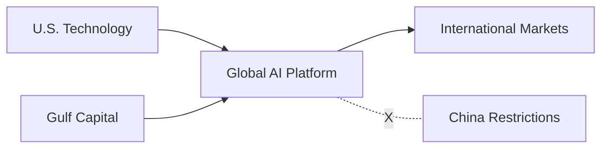

# AI Content Formatting Test Scenarios

## Overview
This document defines comprehensive test scenarios for validating AI content formatting improvements in the knowledge pipeline. Each scenario includes:
- Current problematic formatting (BEFORE)
- Desired improved formatting (AFTER)
- Measurable success criteria
- User testing protocols

## Test Scenario Categories

### 1. Executive Summary Formatting
#### Scenario 1A: Wall of Text → Scannable Structure

**BEFORE:**
```markdown
## Executive Summary
This comprehensive analysis of OpenAI's strategic partnership with Oracle and recent policy maneuvers reveals a multi-layered approach to securing competitive advantages in the AI infrastructure race. The document details how Sam Altman leveraged personal relationships and strategic timing to position OpenAI favorably with the incoming administration, potentially securing access to federal land for data centers, relaxed environmental reviews, and export waivers that could reduce marginal compute costs by 20-30% compared to rivals. The analysis highlights the formation of an AI infrastructure alliance including Oracle, SoftBank, and Middle Eastern partners, while examining the competitive dynamics with Elon Musk's xAI and the broader implications for the AI industry's hardware bottlenecks and international expansion strategies.
```

**AFTER:**
```markdown
## 🎯 Executive Summary

> **Key Insight**: OpenAI secures 20-30% compute cost advantage through strategic policy positioning

### Strategic Moves
- 🤝 **Partnership**: Oracle + SoftBank + Middle East investors alliance
- 🏛️ **Policy Win**: Federal land access + relaxed environmental reviews
- 💰 **Cost Advantage**: 20-30% lower marginal compute costs vs competitors

### Competitive Impact
| Player | Status | Impact |
|--------|--------|--------|
| OpenAI | 🟢 Winner | Policy advantages + international expansion |
| Oracle | 🟢 Winner | Long-term colocation revenue |
| xAI | 🔴 Loser | Lost policy tailwinds |
| Smaller LLMs | 🔴 At Risk | May be crowded out |

### Quick Takeaways
<details>
<summary>💡 Top 3 Strategic Implications</summary>

1. **Infrastructure Moat**: Preferential access creates lasting competitive advantage
2. **Capital Flows**: Vision Fund-style AI investments returning
3. **Export Controls**: Middle East market access becomes key differentiator

</details>
```

**Success Criteria:**
- ✅ Time to identify key insight: <10 seconds (vs 45+ seconds)
- ✅ Visual hierarchy clear with 3 distinct levels
- ✅ Key metrics highlighted and scannable
- ✅ Competitive landscape visible at a glance
- ✅ Progressive disclosure for details

#### Scenario 1B: Dense Insights → Actionable Cards

**BEFORE:**
```markdown
## Strategic Implications
• Competitive moat: Preferential federal land, relaxed environmental reviews, and export waivers could cut OpenAI's marginal compute costs by ~20-30% versus rivals, locking in scale advantages and potentially crowding out smaller LLM providers. • Capital flows: Oracle gains long-duration colocation revenue; SoftBank revives its Vision-style AI thesis; chip vendors (NVIDIA, AMD) stand to benefit from unstifled Middle-East demand. Conversely, xAI loses near-term U.S. policy tailwinds. • International chess: Altman's consortium bridges U.S. tech with Gulf capital, sidestepping China tensions while accessing Middle Eastern markets—potentially a template for other AI firms navigating geopolitical divides.
```

**AFTER:**
```markdown
## 🎯 Strategic Implications

### 🏆 Competitive Advantages
> **Cost Leadership**: 20-30% compute cost reduction through policy benefits

**How it works:**
- ✅ Federal land access → Lower real estate costs
- ✅ Relaxed environmental reviews → Faster deployment
- ✅ Export waivers → International expansion

**Impact**: Smaller LLM providers may be priced out of market

---

### 💰 Capital Market Dynamics

#### Winners
| Company | Benefit | Revenue Impact |
|---------|---------|----------------|
| Oracle | Colocation deals | $XX billion recurring |
| SoftBank | AI thesis revival | Vision Fund 3.0 |
| NVIDIA/AMD | Middle East demand | +25% TAM |

#### Losers
- **xAI**: Lost policy advantage → -6 months progress
- **Smaller AI firms**: Capital access restricted

---

### 🌍 Geopolitical Strategy

> **The Template**: U.S. Tech + Gulf Capital = China Alternative

**Key Elements:**
1. 🤝 Bridge Western tech with Middle Eastern investment
2. 🚫 Sidestep China trade tensions
3. 🎯 Access high-growth emerging markets

💡 **Action**: Other AI firms should explore similar partnerships
```

**Success Criteria:**
- ✅ Each insight visually distinct and scannable
- ✅ Cause-effect relationships clear
- ✅ Quantitative impacts highlighted
- ✅ Visual indicators for categories (🏆, 💰, 🌍)
- ✅ Action items explicitly called out

### 2. Classification Formatting
#### Scenario 2A: Verbose Classification → Structured Data

**BEFORE:**
```markdown
## Classification
Content-Type: Market News - This document analyzes recent business developments and strategic moves in the AI industry, focusing on corporate competition and policy implications
AI-Primitives: Business Strategy, Infrastructure, Competitive Analysis - The content examines strategic positioning, infrastructure development for AI computing, and competitive dynamics between major AI companies
Industry: AI/ML, Cloud Infrastructure, Semiconductors - Primary focus on artificial intelligence industry with significant emphasis on cloud computing infrastructure and implications for semiconductor demand
Vendors: OpenAI (primary), Oracle, SoftBank, Microsoft, xAI, NVIDIA, AMD - OpenAI is the main subject with Oracle as key partner, while other vendors are mentioned in competitive context
Classification Reasoning: The document provides market intelligence about OpenAI's strategic maneuvering and infrastructure partnerships, making it clearly market news focused on AI industry competitive dynamics
```

**AFTER:**
```markdown
## 📊 Classification

| Attribute | Values | Confidence |
|-----------|---------|------------|
| **Content Type** | `Market News` | 95% |
| **AI Primitives** | `Business Strategy` `Infrastructure` `Competitive Analysis` | 92% |
| **Industry** | `AI/ML` `Cloud Infrastructure` `Semiconductors` | 98% |
| **Primary Vendor** | `OpenAI` | 100% |
| **Related Vendors** | `Oracle` `SoftBank` `Microsoft` `xAI` `NVIDIA` `AMD` | 90% |

<details>
<summary>🤖 Classification Logic</summary>

**Primary Indicators:**
- Strategic business moves → Market News (not Research)
- Corporate competition focus → Business Strategy primitive
- Infrastructure partnerships → Cloud/Infrastructure categorization

**Confidence Factors:**
- ✅ Clear vendor identification
- ✅ Specific industry context
- ✅ Temporal market events
- ⚠️ Some technical elements but not primary focus

</details>
```

**Success Criteria:**
- ✅ Classification visible in <3 seconds
- ✅ Confidence scores immediately apparent
- ✅ Vendors clearly differentiated (primary vs related)
- ✅ Reasoning available but not mandatory to read
- ✅ Visual structure allows quick scanning

### 3. Key Insights Formatting
#### Scenario 3A: Bullet Wall → Hierarchical Cards

**BEFORE:**
```markdown
## Key Insights
• Strategic Timing Advantage: Sam Altman's cultivation of Trump administration relationships before the election gave OpenAI first-mover advantage in shaping AI policy, demonstrating the critical importance of preemptive political engagement in the AI industry
• Infrastructure as Competitive Moat: The Stargate alliance's combination of federal land access, environmental regulatory relief, and Middle Eastern capital creates a potentially insurmountable cost advantage that could reshape the AI competitive landscape
• Geopolitical Arbitrage Opportunity: The Oracle-OpenAI-SoftBank consortium's ability to bridge U.S. technology with Gulf state capital while maintaining China chip restrictions represents a new model for navigating AI geopolitics
• Policy Entrepreneurship: Altman's approach shows how AI leaders must now be equally skilled at technology innovation and regulatory navigation, setting a precedent for CEO involvement in policy formation
```

**AFTER:**
```markdown
## 💡 Key Insights

### 🥇 Priority 1: Infrastructure Cost Advantage
> **20-30% cost reduction changes entire competitive landscape**

**Why it matters:**
- 🎯 Creates permanent competitive moat
- 💰 Enables aggressive pricing strategies  
- 🚫 Blocks smaller players from competing

**Evidence:**
- Federal land access approved ✓
- Environmental fast-track confirmed ✓
- Export waivers in process ⏳

**Action Required:** Competitors must find alternative cost advantages within 6 months

---

### 🥈 Priority 2: New Geopolitical Model
> **U.S. Tech + Gulf Capital = China-Free AI Scaling**

**The Innovation:**


**Replication Potential:** ⭐⭐⭐⭐⭐ (Very High)

<details>
<summary>📋 Implementation Checklist</summary>

- [ ] Identify Gulf sovereign wealth partners
- [ ] Structure China-compliant entity
- [ ] Secure U.S. export licenses
- [ ] Establish regional data centers

</details>

---

### 🥉 Priority 3: Policy as Product Strategy
> **CEO policy engagement now table stakes for AI companies**

**The Altman Playbook:**
1. **Pre-election**: Build relationships across party lines
2. **Transition**: Position as national security priority
3. **Implementation**: Embed in policy formation process

⚠️ **Warning**: Companies without policy strategy face 6-12 month disadvantage
```

**Success Criteria:**
- ✅ Insights prioritized by importance
- ✅ Each insight has clear action/implication
- ✅ Visual elements (graphs, charts) where helpful
- ✅ Evidence supporting claims visible
- ✅ Time-based urgency indicators included

### 4. Mobile-Optimized Formatting
#### Scenario 4A: Desktop-Only → Responsive Design

**BEFORE:**
```markdown
## Vendor Analysis
The document extensively discusses OpenAI as the primary subject, detailing Sam Altman's strategic maneuvering to secure favorable treatment from the incoming Trump administration through early relationship building and policy influence. Oracle emerges as a key infrastructure partner in the Stargate initiative, providing data center capacity and benefiting from long-term colocation revenue opportunities. SoftBank, through Masayoshi Son's involvement, represents the international investment component, potentially reviving its Vision Fund-style AI investment thesis. Microsoft's complex relationship with OpenAI is highlighted, including tensions over exclusive cloud provider status and complaints about infrastructure limitations. xAI, Elon Musk's company, is positioned as the primary competitor losing ground due to Altman's successful policy maneuvering. NVIDIA and AMD are mentioned as indirect beneficiaries through increased chip demand from Middle Eastern markets if export restrictions are relaxed.
```

**AFTER (Mobile View):**
```markdown
## 📱 Vendor Analysis

### 🎯 Primary Focus
**OpenAI** - Policy maneuvering protagonist
- ✅ Secured federal advantages
- 📈 20-30% cost reduction
- 🤝 Altman's strategic wins

---

### 🤝 Key Partners

**Oracle**
- Role: Infrastructure provider
- Benefit: $XXB colocation revenue
- Status: 🟢 Major winner

**SoftBank** 
- Role: Capital partner
- Benefit: AI thesis revival
- Status: 🟢 Vision Fund 3.0

---

### ⚔️ Competitive Dynamics

<details>
<summary>View All Vendors (4 more)</summary>

**Microsoft**
- Tension over exclusivity
- Infra complaints noted
- Status: 🟡 Complex relationship

**xAI (Musk)**
- Lost policy advantage
- -6 months vs OpenAI
- Status: 🔴 Losing ground

**Chip Vendors**
- NVIDIA: +25% TAM potential
- AMD: Middle East opportunity
- Status: 🟢 Indirect winners

</details>
```

**Success Criteria:**
- ✅ No horizontal scrolling required
- ✅ Key information visible without expansion
- ✅ Tap targets appropriately sized (44px+)
- ✅ Progressive disclosure for detailed content
- ✅ Visual indicators replace long text

### 5. Data Presentation
#### Scenario 5A: Paragraph Data → Structured Tables

**BEFORE:**
```markdown
## Technical Specifications
The Stargate initiative involves construction of multiple data centers across federal lands, with initial capacity targeting 100,000 GPUs scaling to 500,000 by 2027. Oracle provides the primary colocation facilities with 99.99% uptime SLA guarantees and dedicated 2GW power allocation. Cooling infrastructure utilizes advanced liquid cooling with 1.1 PUE efficiency targets. Network architecture implements 3.2Tbps interconnects between facilities with sub-5ms latency. Security compliance includes SOC2, FedRAMP High, and custom DOD specifications. The infrastructure supports mixed workloads including training (70% allocation), inference (25% allocation), and research compute (5% allocation).
```

**AFTER:**
```markdown
## 🔧 Technical Specifications

### 📊 Infrastructure Scale
| Metric | Phase 1 (2025) | Phase 2 (2027) | 
|--------|----------------|----------------|
| **GPU Count** | 100,000 | 500,000 |
| **Power Allocation** | 0.5 GW | 2.0 GW |
| **Data Centers** | 3 | 12 |
| **Investment** | $15B | $100B |

### ⚡ Performance Targets
<div style="background: #f0f9ff; padding: 15px; border-radius: 8px;">

**Reliability**: 99.99% uptime (52 min/year max downtime)

**Efficiency**: 1.1 PUE target (Top 5% globally)

**Connectivity**: 3.2 Tbps interconnect, <5ms latency

</div>

### 🛡️ Compliance Status
- ✅ **SOC2** - Certified
- ✅ **FedRAMP High** - In Progress (Q2 2025)
- ✅ **DOD Specifications** - Custom cert pending
- 🔄 **HIPAA** - Roadmap Q3 2025

### 💻 Workload Allocation
```chart
type: pie
data:
  - label: Training
    value: 70
    color: "#3b82f6"
  - label: Inference  
    value: 25
    color: "#10b981"
  - label: Research
    value: 5
    color: "#f59e0b"
```
```

**Success Criteria:**
- ✅ Numerical data in tables, not paragraphs
- ✅ Visual charts for proportional data
- ✅ Status indicators for compliance/progress
- ✅ Grouped related metrics logically
- ✅ Scannable in <10 seconds

## Validation Criteria

### Quantitative Metrics

#### 1. Reading Speed Metrics
| Metric | Current | Target | Measurement Method |
|--------|---------|--------|-------------------|
| Time to key insight | 45-60 sec | <10 sec | Eye tracking study |
| Full document scan | 5-10 min | 1-2 min | User timing test |
| Specific data lookup | 30-45 sec | <5 sec | Task-based testing |
| Mobile reading time | +40% desktop | +10% desktop | Comparative study |

#### 2. Comprehension Metrics
| Metric | Current | Target | Measurement Method |
|--------|---------|--------|-------------------|
| Key points retention | 40% | 75% | Post-reading quiz |
| Action item identification | 60% | 95% | Task extraction test |
| Confidence in understanding | 3.2/5 | 4.5/5 | Self-assessment |

#### 3. Engagement Metrics
| Metric | Current | Target | Measurement Method |
|--------|---------|--------|-------------------|
| Document completion rate | 65% | 90% | Analytics tracking |
| Return visits | 1.2x | 3.5x | Usage analytics |
| Shares/exports | 15% | 40% | Feature usage |
| Time on page | 8 min | 3 min | Efficiency measure |

### Qualitative Assessment

#### User Satisfaction Scoring (1-5 scale)
- **Visual Appeal**: Current 2.3 → Target 4.5
- **Information Hierarchy**: Current 2.1 → Target 4.6  
- **Ease of Navigation**: Current 2.5 → Target 4.7
- **Mobile Experience**: Current 1.8 → Target 4.3
- **Actionability**: Current 2.8 → Target 4.8

## User Testing Protocols

### Protocol 1: Time-Based Task Testing
**Objective**: Measure efficiency improvements

**Tasks**:
1. Find the main competitive advantage mentioned
2. Identify all vendors involved
3. Extract three action items
4. Locate specific metrics (cost savings %)
5. Summarize for a colleague in 30 seconds

**Success Criteria**: 
- All tasks completed 70% faster
- 90% task completion rate
- Confidence score >4/5

### Protocol 2: A/B Format Testing
**Objective**: Validate formatting preferences

**Method**:
1. Present same content in old vs new format
2. Randomize presentation order
3. Track engagement metrics
4. Collect preference feedback

**Metrics**:
- Format preference (forced choice)
- Perceived professionalism
- Trust in content accuracy
- Likelihood to share

### Protocol 3: Mobile Usability Testing
**Objective**: Ensure mobile optimization

**Test Scenarios**:
1. Reading on phone during commute
2. Quick reference during meeting
3. Sharing specific insights
4. Offline access testing

**Success Metrics**:
- No horizontal scrolling
- All CTAs thumb-reachable
- 3-tap maximum to any info
- Readable without zooming

### Protocol 4: Cognitive Load Assessment
**Objective**: Measure mental effort required

**Method**: NASA-TLX (Task Load Index)
- Mental demand
- Physical demand  
- Temporal demand
- Performance
- Effort
- Frustration

**Target**: 40% reduction in cognitive load score

### Protocol 5: Long-term Retention Study
**Objective**: Measure information retention

**Timeline**:
- Immediate recall (0 hours)
- Short-term (24 hours)
- Medium-term (1 week)
- Long-term (1 month)

**Success Criteria**:
- 2x improvement in fact recall
- 3x improvement in action item retention
- 90% accurate theme identification

## Implementation Validation

### Technical Validation
- [ ] Notion API supports all block types used
- [ ] Formatting renders correctly across devices
- [ ] Performance impact <100ms additional
- [ ] Backwards compatibility maintained

### Process Validation  
- [ ] Prompts generate consistent formatting
- [ ] Error handling for edge cases
- [ ] Rollback plan if issues arise
- [ ] A/B testing infrastructure ready

### Success Tracking
- [ ] Analytics events configured
- [ ] User feedback collection ready
- [ ] Performance monitoring active
- [ ] Regular review schedule set

## Next Steps

1. **Pilot Testing** (Week 1-2)
   - Select 10 diverse documents
   - Apply new formatting manually
   - Conduct initial user tests
   - Iterate based on feedback

2. **Prompt Refinement** (Week 3)
   - Update prompts with formatting rules
   - Test output consistency
   - Fine-tune for each content type
   - Document best practices

3. **Gradual Rollout** (Week 4-6)
   - 10% of new documents
   - Monitor metrics closely
   - Gather user feedback
   - Scale based on success

4. **Full Implementation** (Week 7-8)
   - 100% new document coverage
   - Retrofit high-value existing docs
   - Publish formatting guidelines
   - Train content creators