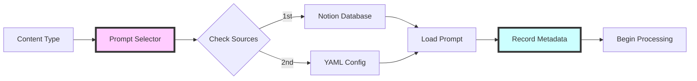

# Prompt Attribution System Guide

## Overview

The Prompt Attribution System in Knowledge Pipeline v4.0 provides complete transparency and traceability for all AI-generated content. Every piece of content includes metadata about which prompt was used, when it was generated, and how well it performed.

## Why Attribution Matters

### Transparency
- Know exactly which prompt generated each piece of content
- Understand the AI's decision-making process
- Build trust through clear documentation

### Optimization
- Track prompt performance over time
- Identify which prompts produce the best results
- Make data-driven improvements

### Compliance
- Maintain audit trails for regulatory requirements
- Document AI usage for governance
- Enable reproducibility of results

## How Attribution Works

### 1. Prompt Selection Phase



### 2. Content Generation Phase

During content generation, the system tracks:

- **Prompt ID**: Unique identifier for the prompt
- **Prompt Source**: Whether it came from Notion or YAML
- **Prompt Version**: Version number for tracking changes
- **Model Used**: Which AI model processed the content
- **Generation Timestamp**: When the content was created

### 3. Attribution Storage

Attribution metadata is stored in multiple locations:

```yaml
# In Notion Page Properties
Attribution_Data: {
  "prompt_id": "summary_research",
  "prompt_source": "notion",
  "prompt_version": "2.1",
  "model": "gpt-4o",
  "timestamp": "2024-11-12T10:30:00Z",
  "quality_score": 85
}

# In Content Blocks
📊 Attribution
- Prompt: Research Summary v2.1
- Source: Notion Database
- Quality Score: 85/100
- Generated: 2024-11-12 10:30 AM
```

## Attribution Metadata Schema

### Core Fields

| Field | Type | Description | Example |
|-------|------|-------------|---------|
| `prompt_id` | string | Unique identifier for the prompt | `"summary_research"` |
| `prompt_source` | enum | Where the prompt came from | `"notion"` or `"yaml"` |
| `prompt_version` | string | Version of the prompt used | `"2.1"` |
| `model` | string | AI model that processed content | `"gpt-4o"` |
| `timestamp` | ISO 8601 | When content was generated | `"2024-11-12T10:30:00Z"` |
| `quality_score` | integer | Quality assessment (0-100) | `85` |

### Extended Fields

| Field | Type | Description | Example |
|-------|------|-------------|---------|
| `token_count` | integer | Tokens used in generation | `1250` |
| `processing_time` | float | Time to generate (seconds) | `3.45` |
| `cache_hit` | boolean | Whether prompt was cached | `true` |
| `web_search_used` | boolean | If web search was enabled | `false` |

## Viewing Attribution

### In Notion

Attribution appears in several places:

1. **Page Properties**: 
   - `Attribution_Prompt` - The prompt ID used
   - `Attribution_Score` - Quality score (0-100)
   - `Attribution_Source` - Notion or YAML

2. **Content Blocks**:
   ```
   📊 Attribution
   ├── Prompt: Market Analysis v3.2
   ├── Source: Notion Database
   ├── Quality: 92/100
   └── Generated: Nov 12, 2024 at 10:30 AM
   ```

3. **Executive Dashboard**:
   - Aggregated attribution statistics
   - Prompt performance metrics
   - Quality score trends

### Via API

```python
# Retrieve attribution for a document
from src.enrichment.prompt_attribution_tracker import PromptAttributionTracker

tracker = PromptAttributionTracker(notion_client)
attribution = tracker.get_attribution(page_id)

print(f"Prompt: {attribution['prompt_id']} v{attribution['prompt_version']}")
print(f"Quality Score: {attribution['quality_score']}/100")
```

## Using Attribution Data

### Performance Analysis

Track which prompts produce the best results:

```python
# Analyze prompt performance
performance = tracker.analyze_prompt_performance("summary_research")
print(f"Average Quality: {performance['avg_quality']}")
print(f"Success Rate: {performance['success_rate']}%")
```

### A/B Testing

Compare different prompt versions:

```python
# Compare prompt versions
v1_stats = tracker.get_version_stats("summary_research", "1.0")
v2_stats = tracker.get_version_stats("summary_research", "2.0")

if v2_stats['avg_quality'] > v1_stats['avg_quality']:
    print("Version 2.0 performs better!")
```

### Debugging

Use attribution to debug content issues:

1. Check which prompt was used
2. Verify the prompt version
3. Review the generation timestamp
4. Analyze the quality score

## Best Practices

### 1. Version Your Prompts

Always increment version numbers when changing prompts:
- Major changes: 1.0 → 2.0
- Minor tweaks: 1.0 → 1.1
- Bug fixes: 1.1 → 1.1.1

### 2. Monitor Quality Scores

Set up alerts for:
- Scores below threshold (e.g., < 70)
- Sudden drops in average quality
- Consistent low performers

### 3. Regular Reviews

Schedule monthly reviews of:
- Prompt performance metrics
- Quality score trends
- Attribution data completeness

### 4. Document Changes

When updating prompts, document:
- What changed and why
- Expected impact
- Performance metrics to monitor

## Troubleshooting

### Missing Attribution

If attribution data is missing:

1. Check environment variables:
   ```bash
   USE_ENHANCED_ATTRIBUTION=true  # Must be enabled
   ```

2. Verify Notion permissions:
   - Integration needs read/write access
   - Database properties must be configured

3. Review logs for errors:
   ```bash
   grep "attribution" logs/pipeline.log
   ```

### Incorrect Attribution

If attribution seems wrong:

1. Clear the prompt cache:
   ```python
   tracker.clear_cache()
   ```

2. Verify prompt database:
   - Check active status in Notion
   - Ensure prompt IDs are unique

3. Validate configuration:
   ```python
   config.validate_attribution_settings()
   ```

## Advanced Features

### Custom Attribution Fields

Add custom fields for your use case:

```python
# Add custom attribution
attribution = {
    "prompt_id": "summary_research",
    "custom_field": "experiment_A",
    "department": "research",
    "cost_center": "R&D"
}
```

### Attribution Webhooks

Set up webhooks for real-time monitoring:

```python
# Configure attribution webhook
ATTRIBUTION_WEBHOOK_URL=https://your-webhook.com/attribution
ATTRIBUTION_WEBHOOK_EVENTS=low_quality,version_change
```

### Export Attribution Data

Export for analysis:

```python
# Export attribution data
tracker.export_attribution_data(
    format="csv",
    date_range="last_30_days",
    output_file="attribution_report.csv"
)
```

## Privacy & Security

### Data Retention

- Attribution data follows content retention policies
- Personally identifiable information is not stored
- Timestamps are in UTC for consistency

### Access Control

- Attribution data inherits Notion page permissions
- API access requires authentication
- Audit logs track attribution access

### Compliance

The attribution system supports:
- GDPR right to explanation
- AI transparency requirements
- Audit trail regulations

## Future Enhancements

### Coming Soon

- Real-time attribution dashboard
- Prompt recommendation engine
- Automated quality improvement
- Cross-pipeline attribution tracking

### Planned Features

- Machine learning optimization
- Natural language attribution queries
- Attribution-based routing
- Cost tracking per prompt

---

For more information, see:
- [Quality Scoring Guide](quality-scoring.md)
- [Prompt Configuration Guide](../guides/prompt-configuration-guide.md)
- [v4.0.0 Release Notes](release-notes.md)