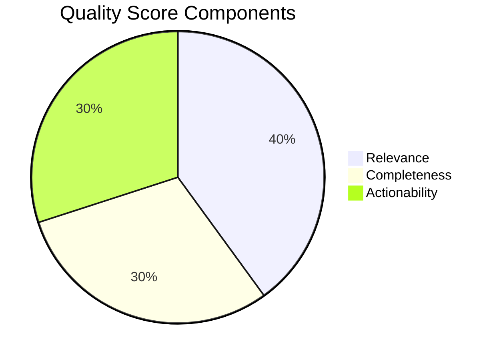

# Quality Scoring Reference Guide

## Overview

The Quality Scoring system in Knowledge Pipeline v4.0 provides automated assessment of content value, helping you focus on high-quality information and identify areas for improvement. Every processed document receives a score from 0-100 based on multiple quality dimensions.

## Scoring Methodology

### Overall Score Composition

The quality score is calculated from three primary components:



### 1. Relevance Score (0-40 points)

Measures how well the content aligns with your research interests:

| Criteria | Weight | Description |
|----------|--------|-------------|
| Topic Match | 15pts | Alignment with configured research areas |
| Keyword Density | 10pts | Presence of important domain terms |
| Source Authority | 10pts | Credibility of the content source |
| Recency | 5pts | How current the information is |

### 2. Completeness Score (0-30 points)

Evaluates the depth and thoroughness of information:

| Criteria | Weight | Description |
|----------|--------|-------------|
| Coverage | 12pts | Breadth of topics covered |
| Detail Level | 10pts | Depth of analysis provided |
| Supporting Data | 8pts | Presence of facts, figures, examples |

### 3. Actionability Score (0-30 points)

Assesses practical value and next steps:

| Criteria | Weight | Description |
|----------|--------|-------------|
| Clear Insights | 12pts | Specific, actionable findings |
| Recommendations | 10pts | Concrete next steps provided |
| Implementation | 8pts | Feasibility of applying insights |

## Score Interpretation

### Score Ranges

| Score | Grade | Interpretation | Recommended Action |
|-------|-------|----------------|-------------------|
| 90-100 | A+ | Exceptional quality | Priority review, share with team |
| 80-89 | A | High quality | Detailed review recommended |
| 70-79 | B | Good quality | Standard review process |
| 60-69 | C | Acceptable | Quick review, extract key points |
| 50-59 | D | Below average | Skim for any useful insights |
| 0-49 | F | Poor quality | Consider filtering out |

### Visual Indicators in Notion

Quality scores appear with visual indicators:

- 🌟 **90-100**: Gold star for exceptional content
- ✅ **70-89**: Green checkmark for quality content  
- ⚡ **50-69**: Yellow lightning for quick review
- ⚠️ **0-49**: Warning sign for low quality

## Detailed Scoring Breakdown

### Relevance Scoring Algorithm

```python
def calculate_relevance_score(content, config):
    score = 0
    
    # Topic Match (15 points)
    if primary_topic in config.research_topics:
        score += 15
    elif secondary_topic in config.research_topics:
        score += 10
    elif related_topic in config.research_topics:
        score += 5
    
    # Keyword Density (10 points)
    keyword_count = count_keywords(content, config.keywords)
    score += min(10, keyword_count * 2)
    
    # Source Authority (10 points)
    if source in config.trusted_sources:
        score += 10
    elif source.domain in config.trusted_domains:
        score += 7
    else:
        score += calculate_domain_authority(source) * 10
    
    # Recency (5 points)
    days_old = (now - publication_date).days
    if days_old <= 7:
        score += 5
    elif days_old <= 30:
        score += 3
    elif days_old <= 90:
        score += 1
    
    return score
```

### Completeness Evaluation

The system evaluates completeness by checking for:

1. **Structural Elements**
   - Introduction/Overview
   - Main body with sections
   - Conclusion/Summary
   - References/Sources

2. **Content Depth**
   - Multiple perspectives presented
   - Examples and case studies
   - Data and statistics
   - Expert quotes

3. **Information Density**
   - Fact-to-fluff ratio
   - Unique insights count
   - Technical detail level

### Actionability Assessment

Actionability is determined by:

1. **Explicit Recommendations**
   - Clear next steps
   - Specific actions to take
   - Implementation guidelines

2. **Practical Applications**
   - Real-world use cases
   - Tools and resources mentioned
   - Timeline suggestions

3. **Decision Support**
   - Pros and cons listed
   - Evaluation criteria
   - Risk assessments

## Quality Score in Action

### In Notion Properties

Each document shows its quality score:

```
📊 Quality Score: 85/100 ✅
├── Relevance: 35/40
├── Completeness: 25/30
└── Actionability: 25/30
```

### In Content Blocks

Quality indicators appear throughout:

```markdown
## 🌟 Key Insights (Score: 92/100)
This section scored highly due to specific, 
actionable recommendations with clear timelines.

## ⚡ Market Analysis (Score: 68/100)
Moderate score - good overview but lacks 
specific data points and recent examples.
```

### In Executive Dashboard

Aggregate quality metrics:

- Average quality score across all content
- Quality score distribution (histogram)
- Trending quality over time
- Low-quality content alerts

## Customizing Quality Scoring

### Configuration Options

```yaml
# config/quality_scoring.yaml
quality_scoring:
  # Adjust component weights
  weights:
    relevance: 40  # Default: 40
    completeness: 30  # Default: 30
    actionability: 30  # Default: 30
  
  # Define quality thresholds
  thresholds:
    exceptional: 90
    high: 80
    good: 70
    acceptable: 60
    poor: 50
  
  # Relevance keywords
  keywords:
    primary:
      - "artificial intelligence"
      - "machine learning"
      - "automation"
    secondary:
      - "data science"
      - "analytics"
      - "optimization"
  
  # Trusted sources
  trusted_sources:
    - "arxiv.org"
    - "nature.com"
    - "ieee.org"
```

### Custom Scoring Rules

Add domain-specific scoring rules:

```python
# Custom scorer for technical documents
class TechnicalDocumentScorer(QualityScorer):
    def score_completeness(self, content):
        base_score = super().score_completeness(content)
        
        # Bonus points for code examples
        if has_code_examples(content):
            base_score += 5
        
        # Bonus for architecture diagrams
        if has_diagrams(content):
            base_score += 3
            
        return min(30, base_score)
```

## Using Quality Scores

### Filtering Content

Use quality scores to filter your reading:

```python
# Only show high-quality content
high_quality = notion_client.query_database(
    database_id=CONTENT_DB,
    filter={
        "property": "Quality Score",
        "number": {
            "greater_than_or_equal_to": 80
        }
    }
)
```

### Prioritizing Review

Create smart views in Notion:

1. **Priority Queue**: Score > 85, sorted by date
2. **Quick Wins**: Score 70-85, < 5 min read time
3. **Deep Dives**: Score > 90, detailed analysis

### Performance Tracking

Monitor content quality trends:

```python
# Track average quality over time
quality_trends = analyzer.get_quality_trends(
    period="last_30_days",
    grouping="weekly"
)

# Alert on quality drops
if quality_trends.latest_average < 70:
    send_alert("Content quality declining")
```

## Improving Quality Scores

### For Content Creators

To create high-scoring content:

1. **Boost Relevance**
   - Use domain-specific terminology
   - Focus on trending topics
   - Cite authoritative sources

2. **Enhance Completeness**
   - Include data and examples
   - Cover multiple perspectives
   - Provide comprehensive analysis

3. **Increase Actionability**
   - Add clear recommendations
   - Include implementation steps
   - Provide tools and resources

### For Pipeline Administrators

Optimize the pipeline for quality:

1. **Tune Prompts**
   - Emphasize quality criteria in prompts
   - Request specific elements (data, examples)
   - Guide AI toward actionable insights

2. **Configure Sources**
   - Prioritize high-authority sources
   - Filter out low-quality domains
   - Set recency requirements

3. **Adjust Scoring**
   - Customize weights for your domain
   - Add custom scoring rules
   - Set appropriate thresholds

## Quality Score API

### Retrieving Scores

```python
from src.enrichment.quality_scorer import QualityScorer

scorer = QualityScorer()

# Score a single document
score = scorer.score_document(content)
print(f"Quality Score: {score.total}/100")
print(f"Breakdown: R:{score.relevance} C:{score.completeness} A:{score.actionability}")

# Batch scoring
scores = scorer.score_batch(documents)
```

### Score Analytics

```python
# Get quality statistics
stats = scorer.get_statistics(
    date_range="last_7_days",
    group_by="source"
)

for source, data in stats.items():
    print(f"{source}: Avg {data.average}, Max {data.max}")
```

### Export Quality Reports

```python
# Generate quality report
report = scorer.generate_report(
    format="pdf",
    include_charts=True,
    date_range="last_month"
)
report.save("quality_report_november.pdf")
```

## Troubleshooting

### Common Issues

1. **All scores are low**
   - Check keyword configuration
   - Verify source authority settings
   - Review scoring weights

2. **Scores seem random**
   - Ensure prompts include quality criteria
   - Check for scoring rule conflicts
   - Validate configuration file

3. **Missing scores**
   - Verify ENABLE_QUALITY_SCORING=true
   - Check API rate limits
   - Review error logs

### Debugging Scores

Enable detailed scoring logs:

```bash
# In .env file
QUALITY_SCORING_DEBUG=true
QUALITY_SCORING_VERBOSE=true
```

This provides detailed breakdown:
```
[SCORING] Document: "AI Market Trends 2024"
[SCORING] Relevance: topic_match=15, keywords=8, authority=9, recency=5 (Total: 37/40)
[SCORING] Completeness: coverage=10, detail=8, data=6 (Total: 24/30)
[SCORING] Actionability: insights=10, recommendations=7, implementation=6 (Total: 23/30)
[SCORING] Final Score: 84/100
```

## Best Practices

1. **Regular Calibration**
   - Review score distributions monthly
   - Adjust weights based on feedback
   - Update keyword lists

2. **Use Scores Wisely**
   - Don't rely solely on scores
   - Consider context and source
   - Allow for manual overrides

3. **Continuous Improvement**
   - Track which high-score content proves valuable
   - Identify patterns in low scores
   - Refine scoring criteria

---

For more information, see:
- [Prompt Attribution Guide](prompt-attribution.md)
- [Configuration Guide](../guides/prompt-configuration-guide.md)
- [v4.0.0 Release Notes](release-notes.md)