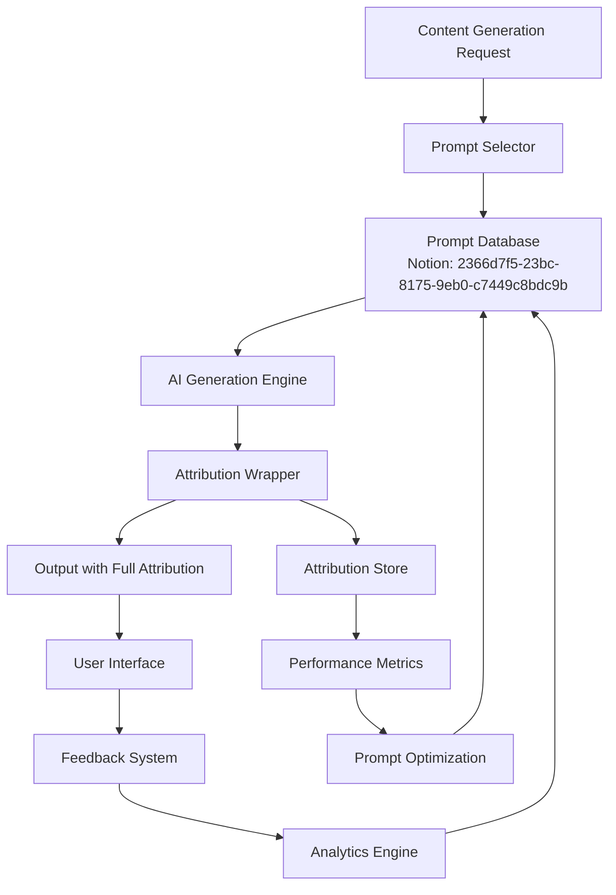

# Prompt Attribution & Traceability System Design

## Overview

This comprehensive system ensures crystal-clear attribution between AI-generated content and the prompts that created them, making the entire knowledge pipeline transparent and traceable.

## 1. Prompt Attribution Headers

Every AI-generated content section will include a standardized attribution header that provides immediate visibility into its origin.

### Standard Attribution Header Template

```markdown
## 🧠 [Section Title]

<div class="prompt-attribution">
  <div class="attribution-header">
    <span class="generated-by">Generated by: <a href="notion://page/{prompt_id}">{prompt_name}</a></span>
    <span class="version-badge">{version}</span>
    <span class="quality-score">⭐⭐⭐⭐ (4.2/5)</span>
    <span class="last-updated">Updated: 2 hours ago</span>
  </div>
  <div class="attribution-actions">
    <button class="view-prompt">📋 View Prompt</button>
    <button class="rate-output">⭐ Rate Output</button>
    <button class="suggest-improvement">💡 Suggest Improvement</button>
    <button class="view-alternatives">🔄 Alternative Prompts</button>
  </div>
</div>
```

### Content Type-Specific Headers

#### Research Content
```markdown
## 🔬 Strategic Research Analysis
Generated by: [Research_Insights_Strategic_v2.3](notion://page/2366d7f5-23bc-81ae-af2b-f449e1025bf2)
Analyzer: insights | Temperature: 0.7 | Web Search: ✅
Quality Score: ⭐⭐⭐⭐⭐ (4.8/5) | Last Updated: 30 minutes ago
[View Prompt Configuration] [Rate This Analysis] [Request Human Review]
```

#### Market News
```markdown
## 📊 Market Impact Analysis
Generated by: [Market_News_Analyzer_v1.5](notion://page/2366d7f5-23bc-8122-adbe-ead9c9223cf7)
Analyzer: market | Temperature: 0.4 | Web Search: ✅
Quality Score: ⭐⭐⭐⭐ (4.5/5) | Last Updated: 1 hour ago
Data Sources: Bloomberg, Reuters, Yahoo Finance
[View Prompt] [Check Sources] [Update Analysis]
```

## 2. Inline Prompt Metadata System

### Hoverable Tooltip Implementation

```html
<span class="ai-generated-content" 
      data-prompt-id="2366d7f5-23bc-81ae-af2b-f449e1025bf2"
      data-prompt-name="Research_Insights_Strategic_v2.3"
      data-temperature="0.7"
      data-model="claude-3-opus"
      data-timestamp="2025-07-20T15:30:00Z"
      data-duration="3.2s">
  <span class="content-text">This breakthrough in quantum computing could reshape...</span>
  <span class="attribution-icon">🤖</span>
</span>
```

### Tooltip Content Structure

```json
{
  "prompt": {
    "name": "Research_Insights_Strategic_v2.3",
    "id": "2366d7f5-23bc-81ae-af2b-f449e1025bf2",
    "type": "insights",
    "category": "Research"
  },
  "generation": {
    "timestamp": "2025-07-20T15:30:00Z",
    "duration": "3.2s",
    "model": "claude-3-opus",
    "temperature": 0.7,
    "max_tokens": 4000,
    "web_search": true
  },
  "sources": [
    {
      "type": "web_search",
      "query": "quantum computing breakthroughs 2025",
      "results_used": 5
    },
    {
      "type": "document",
      "name": "arxiv_paper_2025_quantum.pdf",
      "page_range": "1-15"
    }
  ],
  "quality_metrics": {
    "user_rating": 4.2,
    "total_ratings": 15,
    "accuracy_score": 0.92,
    "relevance_score": 0.88
  }
}
```

## 3. Prompt Performance Dashboard

### Dashboard Components

#### A. Document Attribution View
```yaml
document_attribution:
  title: "Q3 2025 Market Analysis Report"
  total_sections: 8
  prompts_used:
    - prompt_id: "2366d7f5-23bc-8122-adbe-ead9c9223cf7"
      name: "Market_News_Analyzer"
      sections_generated: ["Market Overview", "Sector Analysis"]
      performance:
        avg_rating: 4.5
        generation_time: "2.8s avg"
        success_rate: "98%"
    - prompt_id: "2366d7f5-23bc-81ae-af2b-f449e1025bf2"
      name: "Research_Insights_Strategic"
      sections_generated: ["Technology Trends", "Future Outlook"]
      performance:
        avg_rating: 4.8
        generation_time: "3.2s avg"
        success_rate: "95%"
```

#### B. Prompt History Timeline
```
┌─────────────────────────────────────────────────────────┐
│ Prompt Usage Timeline - Last 7 Days                     │
├─────────────────────────────────────────────────────────┤
│ July 20  ████████████████████ 45 uses  ⭐4.5          │
│ July 19  ██████████████ 32 uses       ⭐4.3           │
│ July 18  █████████████████ 38 uses    ⭐4.6           │
│ July 17  ███████████ 25 uses          ⭐4.2           │
│ July 16  ████████████████ 35 uses     ⭐4.4           │
│ July 15  ██████████ 22 uses           ⭐4.1           │
│ July 14  ████████████████████ 42 uses ⭐4.7           │
└─────────────────────────────────────────────────────────┘
```

#### C. Alternative Prompt Suggestions
```markdown
### 🔄 Alternative Prompts for This Content

Based on your content type (Research) and current performance:

1. **Research_Deep_Dive_v3.0** ⭐4.9 (NEW!)
   - Better at: Technical depth, citation accuracy
   - Trade-off: Slower generation (4.5s avg)
   - [Try This Prompt]

2. **Research_Quick_Insights_v1.2** ⭐4.3
   - Better at: Speed (1.8s avg), conciseness
   - Trade-off: Less comprehensive
   - [Try This Prompt]

3. **Research_Comparative_Analysis_v2.1** ⭐4.6
   - Better at: Multi-source comparison
   - Trade-off: Requires more input data
   - [Try This Prompt]
```

## 4. Source Code Traceability

### Python Implementation

```python
from dataclasses import dataclass
from datetime import datetime
from typing import List, Dict, Optional
import uuid

@dataclass
class PromptAttribution:
    """Complete attribution metadata for AI-generated content"""
    execution_id: str
    prompt_id: str
    prompt_name: str
    prompt_version: str
    prompt_url: str
    content_type: str
    analyzer_type: str
    temperature: float
    model: str
    web_search_enabled: bool
    timestamp: datetime
    duration_seconds: float
    parent_document_id: Optional[str]
    source_documents: List[Dict[str, str]]
    web_search_queries: List[str]
    
class AttributableOutput:
    """Wrapper for AI-generated content with full attribution"""
    
    def __init__(self, content: str, prompt_config: Dict):
        self.content = content
        self.metadata = PromptAttribution(
            execution_id=str(uuid.uuid4()),
            prompt_id=prompt_config['id'],
            prompt_name=prompt_config['name'],
            prompt_version=prompt_config.get('version', '1.0'),
            prompt_url=f"https://notion.so/{prompt_config['id']}",
            content_type=prompt_config['content_type'],
            analyzer_type=prompt_config['analyzer'],
            temperature=prompt_config['temperature'],
            model=prompt_config.get('model', 'claude-3-opus'),
            web_search_enabled=prompt_config.get('web_search', False),
            timestamp=datetime.utcnow(),
            duration_seconds=0.0,  # Set after generation
            parent_document_id=None,
            source_documents=[],
            web_search_queries=[]
        )
    
    def to_notion_block(self) -> Dict:
        """Convert to Notion block with attribution header"""
        return {
            "object": "block",
            "type": "callout",
            "callout": {
                "rich_text": [{
                    "type": "text",
                    "text": {
                        "content": f"Generated by: {self.metadata.prompt_name}",
                        "link": {"url": self.metadata.prompt_url}
                    }
                }],
                "icon": {"emoji": "🤖"},
                "color": "blue_background"
            },
            "children": [
                {
                    "object": "block",
                    "type": "paragraph",
                    "paragraph": {
                        "rich_text": [{
                            "type": "text",
                            "text": {"content": self.content}
                        }]
                    }
                }
            ]
        }
```

### API Response Structure

```json
{
  "output": {
    "content": "Generated analysis content...",
    "sections": [
      {
        "title": "Market Overview",
        "content": "...",
        "attribution": {
          "prompt_id": "2366d7f5-23bc-8122-adbe-ead9c9223cf7",
          "execution_id": "exec_123456"
        }
      }
    ]
  },
  "attribution": {
    "execution_id": "exec_123456",
    "prompt_id": "2366d7f5-23bc-8122-adbe-ead9c9223cf7",
    "prompt_name": "Market_News_Analyzer_v1.5",
    "prompt_url": "https://notion.so/Market-News-Analyzer-2366d7f523bc8122adbeead9c9223cf7",
    "generation_details": {
      "timestamp": "2025-07-20T15:30:00Z",
      "duration_ms": 2834,
      "model": "claude-3-opus",
      "temperature": 0.4,
      "tokens_used": 3521
    },
    "sources": {
      "web_searches": [
        {
          "query": "S&P 500 performance today",
          "results_used": 3
        }
      ],
      "documents": [
        {
          "id": "doc_789",
          "name": "Fed Minutes July 2025",
          "sections_used": ["Summary", "Outlook"]
        }
      ]
    }
  },
  "quality_metrics": {
    "confidence_score": 0.92,
    "source_coverage": 0.88,
    "prompt_adherence": 0.95
  }
}
```

## 5. Visual Attribution System

### Color-Coded Border System

```css
/* Prompt Category Colors */
.prompt-attribution {
  border-left: 4px solid var(--prompt-color);
  padding-left: 16px;
  margin: 16px 0;
}

.prompt-insights { --prompt-color: #8B5CF6; }      /* Purple */
.prompt-summarizer { --prompt-color: #3B82F6; }   /* Blue */
.prompt-classifier { --prompt-color: #10B981; }   /* Green */
.prompt-tagger { --prompt-color: #F59E0B; }       /* Yellow */
.prompt-technical { --prompt-color: #EF4444; }    /* Red */
.prompt-market { --prompt-color: #F97316; }       /* Orange */
.prompt-legal { --prompt-color: #92400E; }        /* Brown */
```

### Visual Components

#### Attribution Badge
```html
<div class="attribution-badge">
  <span class="prompt-icon">📊</span>
  <span class="prompt-type">Analysis</span>
  <span class="quality-indicator">
    <span class="stars">⭐⭐⭐⭐</span>
    <span class="score">4.2</span>
  </span>
  <span class="version-badge">v2.1</span>
</div>
```

#### Prompt Type Icons
- 📊 Analysis (insights)
- 📝 Summary (summarizer)
- 🏷️ Tagging (tagger)
- 🎯 Classification (classifier)
- 🔧 Technical (technical)
- 📈 Market (market)
- ⚖️ Legal (legal)

## 6. User Feedback Collection System

### Inline Feedback Widget

```javascript
class PromptFeedback {
  constructor(executionId, promptId) {
    this.executionId = executionId;
    this.promptId = promptId;
  }
  
  async submitRating(rating, feedback) {
    return await fetch('/api/prompt-feedback', {
      method: 'POST',
      body: JSON.stringify({
        execution_id: this.executionId,
        prompt_id: this.promptId,
        rating: rating,
        feedback: feedback,
        timestamp: new Date().toISOString(),
        user_context: {
          document_id: getCurrentDocumentId(),
          section: getCurrentSection()
        }
      })
    });
  }
  
  async suggestImprovement(suggestion) {
    return await fetch('/api/prompt-improvements', {
      method: 'POST',
      body: JSON.stringify({
        prompt_id: this.promptId,
        suggestion: suggestion,
        example_output: this.getCurrentOutput(),
        desired_output: suggestion.desired_output
      })
    });
  }
}
```

### Feedback Analytics Dashboard

```yaml
prompt_analytics:
  prompt_id: "2366d7f5-23bc-8122-adbe-ead9c9223cf7"
  total_uses: 1247
  average_rating: 4.2
  rating_distribution:
    5_stars: 423
    4_stars: 567
    3_stars: 198
    2_stars: 45
    1_star: 14
  common_feedback:
    - "Excellent market analysis depth"
    - "Could use more specific tickers"
    - "Time horizon unclear sometimes"
  improvement_suggestions: 23
  a_b_test_results:
    version_2_0: {rating: 4.0, uses: 623}
    version_2_1: {rating: 4.2, uses: 624}
```

## 7. Implementation Architecture

### System Components



### Database Schema

```sql
-- Prompt execution tracking
CREATE TABLE prompt_executions (
    execution_id UUID PRIMARY KEY,
    prompt_id VARCHAR(255) NOT NULL,
    prompt_version VARCHAR(50),
    timestamp TIMESTAMP NOT NULL,
    duration_ms INTEGER,
    model VARCHAR(100),
    temperature DECIMAL(3,2),
    tokens_used INTEGER,
    parent_document_id VARCHAR(255),
    user_id VARCHAR(255),
    success BOOLEAN,
    error_message TEXT
);

-- Source attribution
CREATE TABLE execution_sources (
    id SERIAL PRIMARY KEY,
    execution_id UUID REFERENCES prompt_executions(execution_id),
    source_type VARCHAR(50), -- 'web_search', 'document', 'api'
    source_identifier TEXT,
    source_metadata JSONB
);

-- Quality metrics
CREATE TABLE execution_quality (
    execution_id UUID PRIMARY KEY REFERENCES prompt_executions(execution_id),
    user_rating DECIMAL(2,1),
    confidence_score DECIMAL(3,2),
    accuracy_score DECIMAL(3,2),
    relevance_score DECIMAL(3,2),
    feedback_count INTEGER DEFAULT 0
);

-- User feedback
CREATE TABLE user_feedback (
    id SERIAL PRIMARY KEY,
    execution_id UUID REFERENCES prompt_executions(execution_id),
    prompt_id VARCHAR(255),
    rating INTEGER CHECK (rating >= 1 AND rating <= 5),
    feedback_text TEXT,
    improvement_suggestion TEXT,
    timestamp TIMESTAMP DEFAULT NOW()
);
```

## 8. Notion Integration

### Relation Properties

```javascript
// Add to Knowledge Database
const knowledgeEntryWithAttribution = {
  properties: {
    "Title": {title: [{text: {content: "Q3 Market Analysis"}}]},
    "Content Type": {select: {name: "Market News"}},
    "Generated By Prompt": {  // New relation field
      relation: [{id: "2366d7f5-23bc-8122-adbe-ead9c9223cf7"}]
    },
    "Prompt Version": {rich_text: [{text: {content: "v1.5"}}]},
    "Generation Metadata": {  // New JSON field
      rich_text: [{text: {content: JSON.stringify({
        execution_id: "exec_123456",
        timestamp: "2025-07-20T15:30:00Z",
        duration_ms: 2834,
        quality_score: 4.2
      })}}]
    }
  }
};
```

### Automated Rollup Properties

```yaml
prompt_performance_rollup:
  - Total Uses: COUNT(Knowledge Entries)
  - Average Rating: AVERAGE(Quality Score)
  - Success Rate: PERCENTAGE(Successful Generations)
  - Average Duration: AVERAGE(Generation Time)
  - Last Used: MAX(Generation Timestamp)
```

## Deliverable Summary

### 1. Attribution Header Templates ✅
- Standard header with prompt link, quality score, and actions
- Content-type specific variations
- Responsive design for mobile/desktop

### 2. Notion Page Relations ✅
- Bidirectional relations between prompts and generated content
- Rollup properties for performance metrics
- Automated quality tracking

### 3. Visual Design System ✅
- Color-coded borders by analyzer type
- Icon system for prompt categories
- Quality indicators and version badges
- Hover states and interactive elements

### 4. Attribution API ✅
- RESTful endpoints for attribution data
- Real-time quality metrics
- Feedback submission system
- Performance analytics

### 5. User Feedback Collection ✅
- Inline rating widget
- Improvement suggestion form
- A/B testing framework
- Analytics dashboard

This system ensures every piece of AI-generated content is fully traceable to its origin prompt, making the knowledge pipeline transparent, accountable, and continuously improvable.